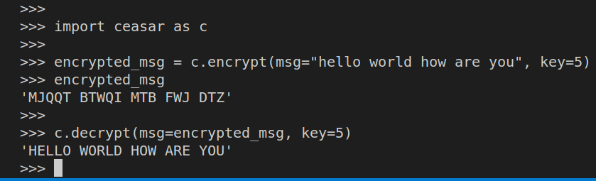
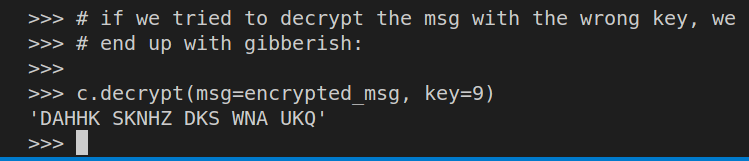

> Exercise 1.1 (Shift Cipher Encoder)
> 
> Create a Python program that encodes and decodes messages using the shift cipher 
> described in this section. The amount of shift must be configurable. 

--------------------------------

Suppose the following python code is found in a file called `ceasar.py`. 

```python
from string import ascii_uppercase
import io

NUM_OF_ALPHABETS = len(ascii_uppercase)

def core(msg: str, shift: int = 0) -> str: 
    retval = io.StringIO()

    for single_char in msg:
        if single_char not in ascii_uppercase:
            retval.write(single_char)
            continue
        retval.write(ascii_uppercase[(ascii_uppercase.index(single_char) + shift) % NUM_OF_ALPHABETS])

    contents = retval.getvalue()
    retval.close()
    return contents

def encrypt(msg: str, key: int): 
    assert(key > 0)
    return core(msg.upper(), key)

def decrypt(msg: str, key: int): 
    assert(key > 0)
    return core(msg.upper(), -1 * key)
```

Usage: 



