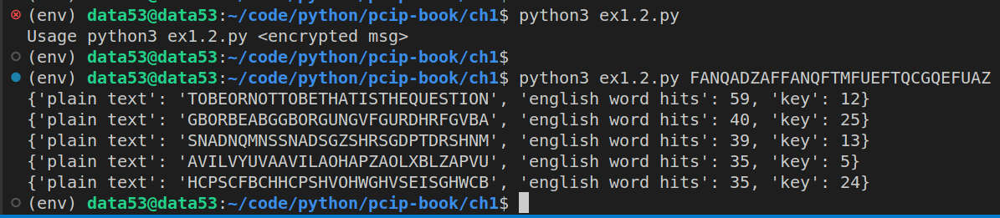

> Exercise 1.2: Automated Decoding
> 
> In our example, Eve tried decoding various messages until she saw something that 
> looked like English. Try automating this. 
> 
> * Get a data structure containing a few thousand English words. $^1$
> 
> * Create a program that takes in an encoded string, then try decoding it with all 
> 25 shift values. 
> 
> * Use the dictionary to try to automatically determine which shift is most likely. 
> 
> Because you have to deal with messages with no spaces, you can simply keep a count 
> of how many dictionary words show up in the decoded output. Occasionally, one or two 
> words might appear by accident, but the correct decoding should have significantly 
> more hits. 
> 
> $^1$ You can find lists of such words online, and your program can automatically populate 
> your data structure with them. 

--------------------------------

The lists of words I used can be found at https://github.com/dwyl/english-words . More specifically
I used the `words_alpha.txt` file in the repo. 

The code to perform automated decoding is given below. Note that it uses the `caesar.py` script given in 
the answer of exercise 1.1.

```python
import caesar as c
import sys

def load_english_words() -> list[str]:
    '''
    This function loads all of the english words 
    in the file ~ 370K english words.
    '''
    with open('words_alpha.txt') as word_file:
        english_words = word_file.read().split()

    return english_words

def generate_the_25_possible_plain_text_values(msg: str) -> list[str]: 
    return [
        c.decrypt(msg=msg, key=key)
        for key in range(1, 26)
    ]

def automated_decoding(encrypted_msg: str) -> list[dict]: 
    possible_plain_text_values = generate_the_25_possible_plain_text_values(encrypted_msg)
    english_words = load_english_words()

    likelihood_of_correctness = dict()

    for plain_text in possible_plain_text_values: 
        likelihood_of_correctness[plain_text] = 0

        for english_word in english_words:
            if plain_text.rfind(english_word.upper()) != -1: 
                likelihood_of_correctness[plain_text] += 1 

    likelihood_of_correctness = sorted(likelihood_of_correctness.items(), key=lambda t:t[1], reverse=True)
    return [
        {
            "plain text": _[0], 
            "english word hits": _[1], 
            "key": possible_plain_text_values.index(_[0]) + 1
        } 
        for _ in likelihood_of_correctness[:5]
    ]

if __name__ == '__main__': 
    if len(sys.argv) != 2: 
        print("Usage python3 ex1.2.py <encrypted msg>")
        exit(-1)
    top_5_most_likely_plaintexts = automated_decoding(encrypted_msg=sys.argv[1])
    for possible_plaintext in top_5_most_likely_plaintexts: 
        print(possible_plaintext)
    
```

Usage: (assuming the above script is inside of a file called `ex1.2.py`)




If you think you know a better algorithm/data structure to keep all the words, don't forget to 
hit a pull request (or an issue explaining your ideas). 👍👍

And don't forget to use python version 3.10 or above. 