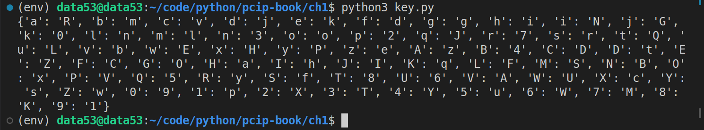
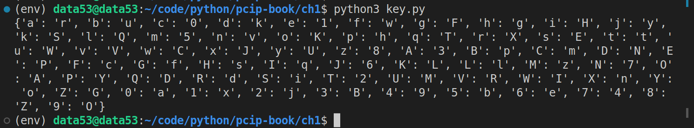
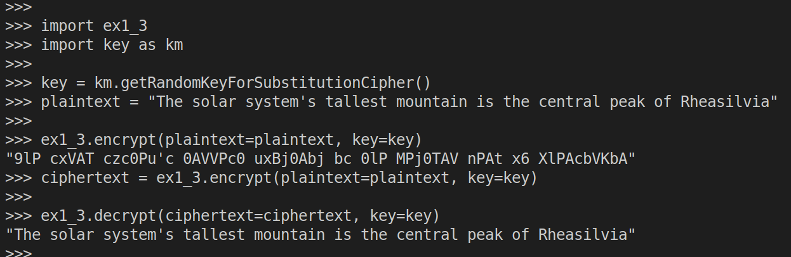

> Exercise 1.3 (A strong substitution cipher) 
> 
> What if instead of shifting the alphabet, you randomly jumbled the letters? 
> Create a program that encodes and decodes messages using this kind of substitution. 
> 
> Some newspapers publish puzzles like this called _cryptograms_. 

--------------------------------

In cryptography, a **substitution cipher** is a method of encrypting, in which units 
of plaintext are replaced with the ciphertext, in a defined manner, with the help of 
a key; the "units" may be single letters (the most common), pairs of letters, triplets
of letters, mixtures of the above, and so forth. The receiver deciphers the text by 
performing the inverse substitution process to extract the original message. 
[Read more here.](https://en.wikipedia.org/wiki/Substitution_cipher)

The following code is used to generate the key. 

```python
# key.py 

import secrets
import string

alphabet = string.ascii_letters + string.digits 

def getRandomChar(): 
    l = list(alphabet)
    while len(l) > 0: 
        n = secrets.randbelow(len(l))
        retval = l.pop(n)
        yield retval 

def getRandomKeyForSubstitutionCipher() -> dict[str, str]:
    return dict(zip(alphabet, getRandomChar()))

def reverseKey(key: dict[str, str]) -> dict[str, str]: 
    retval = dict()
    for k, v in key.items(): 
        retval[v] = k 
    return retval 

if __name__ == '__main__': 
    print(getRandomKeyForSubstitutionCipher())
```





```python
# ex1_3.py 

import key as km

def encrypt(plaintext: str, key: dict[str, str]) -> str: 
    return ''.join(key.get(p,p) for p in plaintext)

def decrypt(ciphertext: str, key: dict[str, str]) -> str: 
    _key = km.reverseKey(key=key)
    return encrypt(plaintext=ciphertext, key=_key)
```

