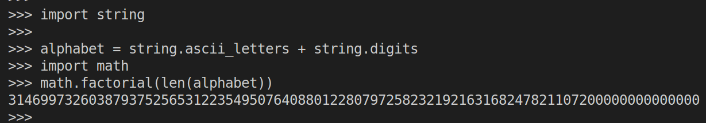

> Exercise 1.4 Count the dictionaries
> 
> How many substitution dictionaries are possible for the cryptogram-style 
> substitution in the previous exercise? 

--------------------------------

Note that the alphabet that was used in the `key.py` files was 

```python
import string

alphabet = string.ascii_letters + string.digits 
```



Thus, the number of substitution dictionaries that are possible is $62! \approx 2^{284.018}$.