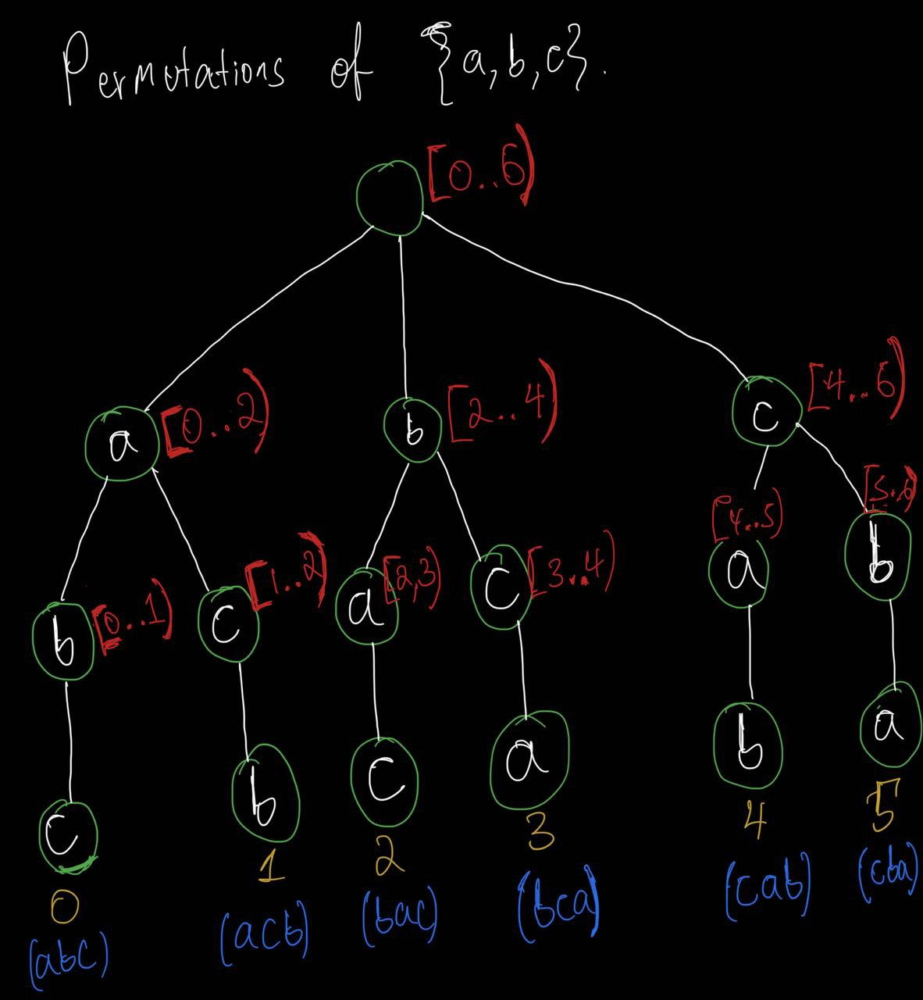
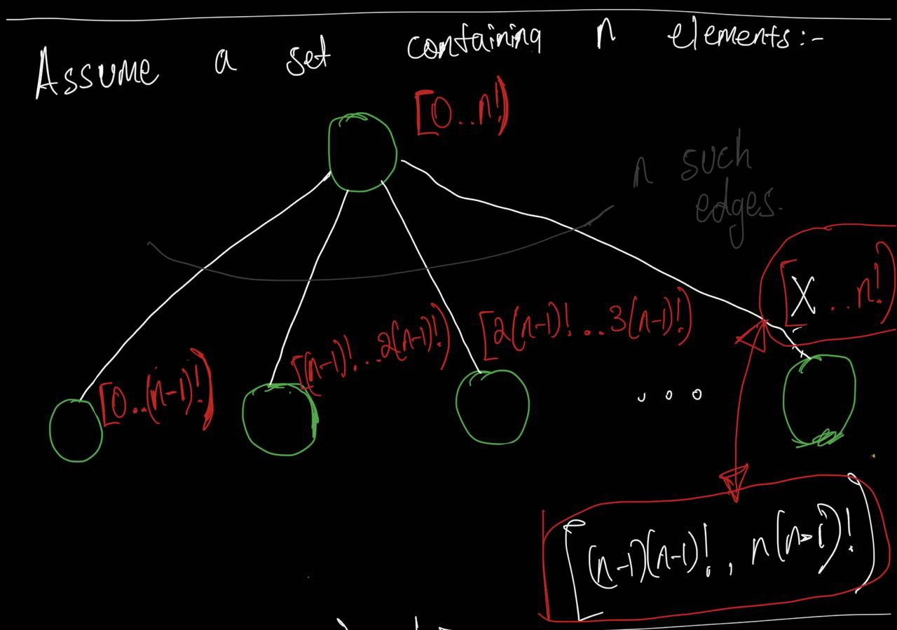
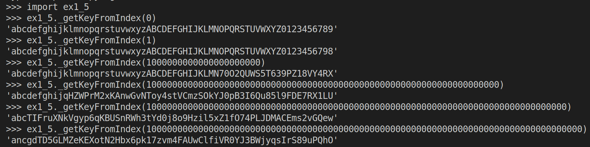
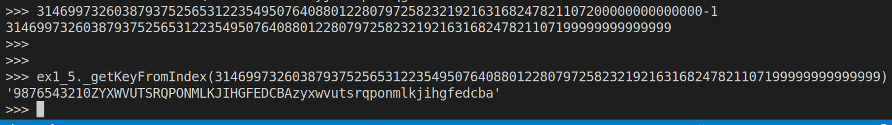

> Exercise 1.5 Identifying the dictionary
>
> Modify your cryptogram program so that you can identify and pick the jumbled 
> character substitution map with a number. That is, each mapping has a unique number
> that identifies it: picking substitution $n$ should create the same substitution 
> mapping every time. This exercise is a little tougher than the others. Do your best!

--------------------------------

Let's simplify the problem and consider the set $\{a, b, c\}$. Since $3! = 6$ we know 
that it has $6$ permutations. So, what we want is to assign this $6$ permutations unique 
numbers starting from $0$ upto $5$. The following tree might help us do just that: 



The intervals written in red, next to the nodes, in the above picture tell us which permutations are under them. 
Consider the node that has the interval **[2..4)**. The half open interval represents a set: 
$[2..4) = \{2, 3\}$. This means that the permutations that have ID
$2 \: \text{and} \: 3$ are below it. 

|permutations of $\{a, b, c\}$|Number that identifies it|
|-----------------------------|-------------------------|
|$a, b, c$| 0 |
|$a, c, b$| 1 |
|$b, a, c$| 2 |
|$b, c, a$| 3 |
|$c, a, b$| 4 |
|$c, b, a$| 5 |

Okay, let's generalize a bit: 



Given an integer $z$ satisfying $0 \leq z < n!$ , do you think we can traverse this tree from the 
root node down to leaf node  and then return the permutation that corresponds to $z$? 

That is exactly what the function `_getKeyFromIndex()` does in the following code. 

```python
# ex1_5.py 

import string
from math import factorial as f
import ex1_3 # look at exercise 1.3

alphabet = string.ascii_letters + string.digits

def _getKeyFromIndex(z: int) -> str: 
    n = len(alphabet)
    assert(z >= 0 and z < f(n))

    result = []
    _alphabet = list(alphabet)
    while n > 0:
        q = int(z // f(n-1))
        result.append(_alphabet.pop(q))
        z -= q * f(n-1)
        n = len(_alphabet)
    
    return ''.join(result)


def getKeyFromIndex(z: int) -> dict[str, str]: 
    primitive_key = _getKeyFromIndex(z = z)
    return dict(zip(alphabet, primitive_key)) 

def encryptUsingIndex(plaintext: str, key: int) -> str: 
    '''
    constraints
    -----------
    key >= 0 and 
    key < 31469973260387937525653122354950764088012280797258232192163168247821107200000000000000
    '''
    actual_key = getKeyFromIndex(z = key)
    return ex1_3.encrypt(plaintext=plaintext, key=actual_key)

def decryptUsingIndex(ciphertext: str, key: int) -> str: 
    '''
    constraints
    -----------
    key >= 0 and 
    key < 31469973260387937525653122354950764088012280797258232192163168247821107200000000000000
    '''
    actual_key = getKeyFromIndex(z = key)
    return ex1_3.decrypt(ciphertext=ciphertext, key=actual_key)
```

Note that when we pass the smallest key (i.e. zero) to the function `_getKeyFromIndex`, 
we get `alphabet` as is:



Note that when we pass the biggest key to the function `_getKeyFromIndex`, we get `alphabet` 
in reverse: 



`encryptUsingIndex()` and `decryptUsingIndex()` are straight forward except that you need to pass 
in an **int** as a key instead of a **dict**. 