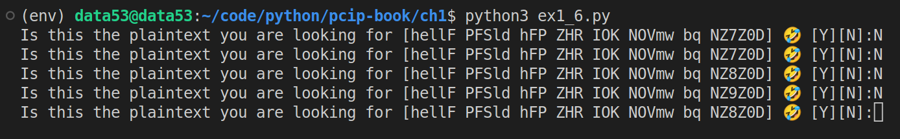

> Exercise 1.6 Brute Force
> 
> Try having your cryptogram-decoding program brute force a message. 
> How long would it take to test every possible mapping? Can you write a program that 
> can speed this up with any kind of "smart guess"? 

--------------------------------

Possible brute force code:

```python
# ex1_6.py

import ex1_5

def bruteforce(ciphertext: str): 
    for possible_key in range(31469973260387937525653122354950764088012280797258232192163168247821107200000000000000):
        possible_plaintext = ex1_5.decryptUsingIndex(ciphertext=ciphertext, key=possible_key)
        x = input(f"Is this the plaintext you are looking for [{possible_plaintext}] 🤣 [Y][N]:")
        if x == 'Y': 
            # we found the plain text we are looking for hooray
            return 

bruteforce("hellF PFSld hFP ZHR IOK NOVmw bq NZ7Z0D")
```

Running the code: 



As you can imagine this will take an awful amount of time. 

Not only that, we can even have _"fake plaintexts"_. That is plaintext that the attacker thinks is
correct but was not the actual plaintext that was sent. This arises when the attacker decrypts the 
ciphertext with a wrong key and by coincidence the incorrect plaintext contains english words 
luring the attacker into believing he has found the correct key (even though he didn't). 

The cryptanalysis method [Frequency analysis](https://en.wikipedia.org/wiki/Frequency_analysis ) seems 
to be effective against such ciphers.
