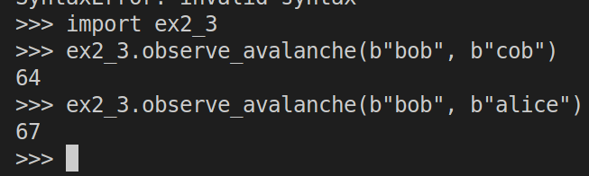

> Observing Avalanche
> 
> Compare the bit changes between a wide range of input values. 
> 

--------------------------------

The following function `observe_avalanche(x1, x2)` is used to 
count the bit changes or differences between $\text{md5}(x_1)$ and 
$\text{md5}(x_2)$: 

```python
# assume this code is stored inside of a file called: ex2_3.py

import hashlib

h = lambda x : hashlib.md5(x).hexdigest()

def observe_avalanche(x1: bytes, x2: bytes) -> int: 
    y1 = h(x1)
    y2 = h(x2)

    change_to_binary = lambda x : bin(int(x,16))[2:]

    b_y1 = change_to_binary(y1)
    b_y2 = change_to_binary(y2)

    if len(b_y1) != 128: 
        b_y1 = ('0' * (128 - len(b_y1))) + b_y1

    if len(b_y2) != 128: 
        b_y2 = ('0' * (128 - len(b_y2))) + b_y2
    
    # counter is the number of bits that are different in 
    # digests of x1 and x2. 
    counter = 0
    for x, y in zip(b_y1, b_y2): 
        if x != y: 
            counter += 1 
    return counter
```

The following shows the usage of the above function: 

