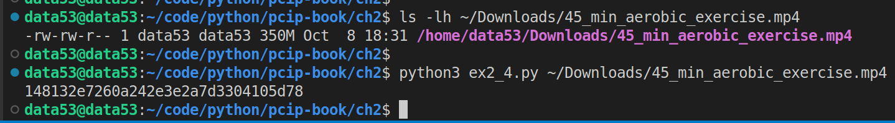
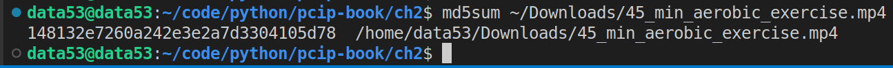

> MD5 OF A FILE
> 
> Write a python program that computes the MD5 sum of the data in 
> a file. You don't need to worry about any of the file's metadata, 
> such as last modified time or even the file's name, only 
> its contents. 

--------------------------------

```python
# ex2_4.py 

import hashlib
import sys

def md5_a_file(filename: str)->str:
    h = hashlib.md5()
    with open(filename, 'rb') as f: 
        data = f.read(4096)
        while data != b'': 
            h.update(data)
            data = f.read(4096)
    return h.hexdigest() 

if __name__ == '__main__': 
    if len(sys.argv) != 2: 
        print("Usage: python3 ex2_4.py <filename>")
        exit(-1)
    filename = sys.argv[1]
    print(md5_a_file(filename))
```

The following shows how to use the above script to md5 a $350$ megabyte 
video file: 



We can see that, we got the same result, as that of the program **md5sum**: 


