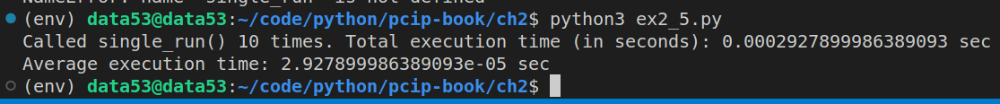
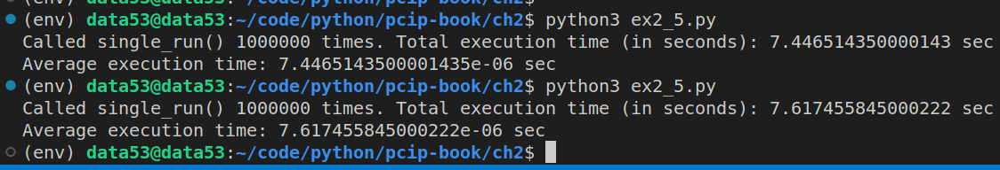

> EXERCISE 2.5. THE POWER OF ONE
> 
> Write a program that does the following ten times (so, ten full loops with the time computed): 
> 
> 
> * Randomly select a single, lowercase letter. This is the "preimage seed."
> * Use MD5 to compute the hash of this initial letter. This is the "test hash". 
> * In a loop, iterate through all possible lowercase one-letter inputs.
>     * Hash each letter in the same way as before, and compare against the test hash. 
>     * When you find a match, stop. 
> * Compute the amount of time it took to find a match. 
> 
> How long, on average, did it take to find a match for a random preimage seed? 

--------------------------------

```python
# ex2_5.py 

import hashlib
import secrets
import timeit
from string import ascii_lowercase

def single_run(): 

    def h(x: str) -> str:
        '''returns the md5 digest of the string x.'''
        return hashlib.md5(x.encode('utf-8')).hexdigest()

    preimage_seed = secrets.choice(ascii_lowercase)
    test_hash = h(preimage_seed)

    for single_letter in ascii_lowercase: 
        if h(single_letter) == test_hash: 
            # found a match
            break
    return 

if __name__ == '__main__':
    COUNTER = 10
    total_execution_time = timeit.timeit(
        stmt="single_run()", 
        setup="from __main__ import single_run", 
        number=COUNTER, 
    )
    print(f"Called single_run() {COUNTER} times. Total execution time (in seconds): {total_execution_time} sec")
    print(f"Average execution time: {total_execution_time/COUNTER} sec")
```

When **COUNTER** is 10. 


When **COUNTER** is 1 million. 

