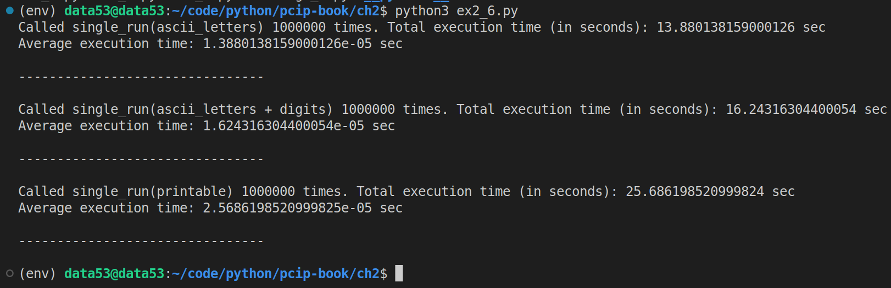

> EXERCISE 2.6 THE POWER OF ONE, BUT BIGGER!
> 
> Repeat the previous exercise, but use an increasingly bigger input 
> alphabet set. Try the test with both lowercase and uppercase letters. Then 
> try it with lowercase letters, uppercase letters, and numbers. Finally, try 
> all printable characters (**string.printable**). 
> 
> * How many total symbols are in each input set?
>  
> * How much longer does each run take? 

--------------------------------

> * How many total symbols are in each input set?

|Input set|Python equivalent|Number of total symbols|
|---------|-----------------|-----------------------|
|lowercase and uppercase letters|`string.ascii_letters`|52|
|lowercase letters, uppercase letters, and numbers|`string.ascii_letters + string.digits`|62|
|all printable characters|`string.printable`|100|

> * How much longer does each run take? 

I used the following code to answer this question: 

```python
# ex2_6.py 

import hashlib
import secrets
import timeit
from string import ascii_letters, digits, printable

possible_alphabets = {
    "ascii_letters": ascii_letters, 
    "ascii_letters + digits": ascii_letters + digits, 
    "printable": printable,
}

def single_run(alphabet_name: str): 
    alphabet = possible_alphabets[alphabet_name]
    
    def h(x: str) -> str:
        '''returns the md5 digest of the string x.'''
        return hashlib.md5(x.encode('utf-8')).hexdigest()

    preimage_seed = secrets.choice(alphabet)
    test_hash = h(preimage_seed)

    for single_letter in alphabet: 
        if h(single_letter) == test_hash: 
            # found a match
            break
    return 

if __name__ == '__main__':
    COUNTER = 1_000_000

    for alpha_name, alpha_value in possible_alphabets.items(): 
        total_execution_time = timeit.timeit(
            stmt=f"single_run('{alpha_name}')", 
            setup="from __main__ import single_run", 
            number=COUNTER, 
        )
        print(f"Called single_run({alpha_name}) {COUNTER} times. Total execution time (in seconds): {total_execution_time} sec")
        print(f"Average execution time: {total_execution_time/COUNTER} sec")
        print("\n--------------------------------\n")
```

