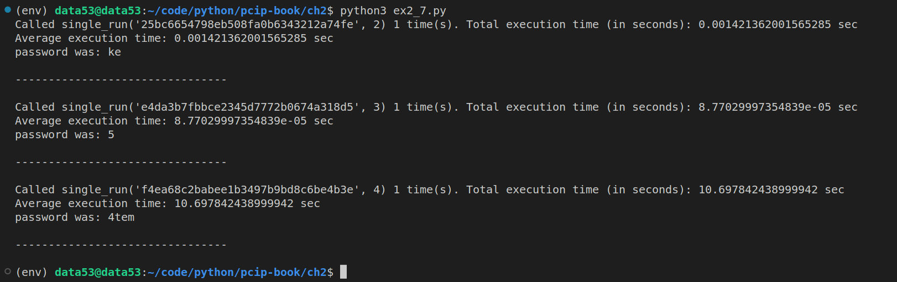

> EXERCISE 2.7 PASSWORD LENGTH'S EFFECTS ON ATTACK TIME
> 
> Repeat the previous exercise, but this time for two-symbol inputs. Then 
> try it with three and four symbols at a time. How much longer does it take 
> to invert the randomly chosen input? 

--------------------------------

Suppose the password is constructed from lowercase letters, uppercase letters, and numbers.
Thus the python equivalent for this is `string.ascii_letters + string.digits`. This set contains
$62$ elements. 

Thus, 

|Maximum length of password|Number of total passwords|
|--------------------------|-------------------------|
|$2$|$62 + 62^2 = 3,906$|
|$3$|$62 + 62^2 + 62^3 = 242,234$|
|$4$|$62 + 62^2 + 62^3 + 62^4 = 15,018,570$|
|$n$|$\frac{62}{61}(62^n-1)$|


```python
# ex2_7.py 

import hashlib
import secrets
import timeit
from string import ascii_letters, digits

ALPHABET = ascii_letters + digits

def generate_random_password(max_length_of_password: int) -> str:
    length_of_password = 1 + secrets.randbelow(max_length_of_password) 
    return ''.join(secrets.choice(ALPHABET) for _ in range(length_of_password))

def h(x: str) -> str:
    '''returns the md5 digest of the string x.'''
    return hashlib.md5(x.encode('utf-8')).hexdigest()

def single_run(digest_of_password: str, max_length_of_password: int): 
    def generate(alphabet, max_len):
        if max_len <= 0: return
        for c in alphabet:
            yield c
        for c in alphabet:
            for next in generate(alphabet, max_len-1):
                yield c + next

    for possible_password in generate(alphabet=ALPHABET, max_len=max_length_of_password): 
        if h(possible_password) == digest_of_password: 
            # found a match
            break
    return 

if __name__ == '__main__':
    COUNTER = 1

    for length_of_password in range(2,5):
        rand_pass = generate_random_password(max_length_of_password=length_of_password)
        h_rand_pass = h(rand_pass) 
        total_execution_time = timeit.timeit(
            stmt=f"single_run('{h_rand_pass}', {length_of_password})", 
            setup="from __main__ import single_run", 
            number=COUNTER, 
        )
        print(f"Called single_run('{h_rand_pass}', {length_of_password}) {COUNTER} time(s). Total execution time (in seconds): {total_execution_time} sec")
        print(f"Average execution time: {total_execution_time/COUNTER} sec")
        print(f"password was: {rand_pass}")
        print("\n--------------------------------\n")
```



How about the worst case scenario??

Note that 

```python
>>> import ex2_7
>>> ex2_7.ALPHABET
'abcdefghijklmnopqrstuvwxyzABCDEFGHIJKLMNOPQRSTUVWXYZ0123456789'
>>> 
```

Thus: 

