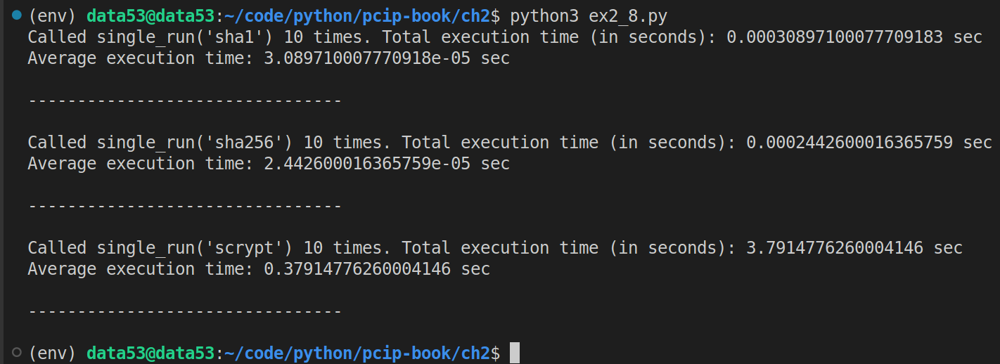
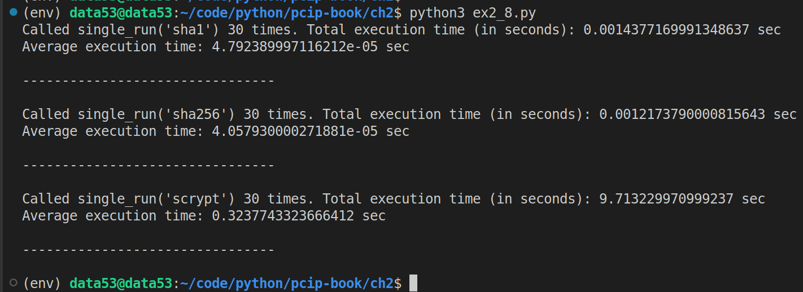

> EXERCISE 2.8 MORE HASH, MORE TIME
> 
> Choosing a complex-to-invert password is the responsibility 
> of the user, but the systems storing the passwords can also 
> slow down attackers by using a more complicated _hashing function_. 
> Repeat any of the preceding exercies that use MD5, but now use SHA-1 
> and SHA-256 instead. Record how much longer it takes to get through 
> the brute-force operations. Finally, try out bruteforce using scrypt. 
> You might not get very far!

--------------------------------

I will use exercise 2.5 by changing the hash function from MD5 to 
SHA-1, SHA-256, and Scrypt. 

```python
# ex2_8.py 

import hashlib
import secrets
import timeit
from string import ascii_lowercase
from cryptography.hazmat.primitives.kdf.scrypt import Scrypt
from cryptography.hazmat.backends import default_backend
from cryptography.exceptions import InvalidKey 

def h_sha1(x: str) -> str:
    '''returns the sha1 digest of the string x.'''
    return hashlib.sha1(x.encode('utf-8')).hexdigest()

def h_sha256(x: str) -> str:
    '''returns the sha256 digest of the string x.'''
    return hashlib.sha256(x.encode('utf-8')).hexdigest()

def h_scrypt(x: str) -> dict[str,bytes]:
    '''returns the Scrypt digest of the string x.'''
    salt = secrets.token_bytes(16)
    kdf = Scrypt(salt=salt, length=32, n=2**14, r=8, p=1, backend=default_backend())
    key = kdf.derive(x.encode('utf-8'))
    return {
        "salt": salt, 
        "key": key, 
    }

def h_scrypt_verify(x: str, salt: bytes, key: bytes):
    kdf = Scrypt(salt=salt, length=32, n=2**14, r=8, p=1, backend=default_backend())
    kdf.verify(x.encode('utf-8'), key)

hashing_functions = {
    "sha1": h_sha1, 
    "sha256": h_sha256, 
    "scrypt": h_scrypt, 
}

def single_run(hashing_function_name: str):
    h = hashing_functions[hashing_function_name]

    preimage_seed = secrets.choice(ascii_lowercase)
    test_hash : dict[str,bytes] | str = h(preimage_seed)

    for single_letter in ascii_lowercase: 
        if hashing_function_name in ['sha1', 'sha256']:
            if h(single_letter) == test_hash: 
                # found a match
                break
        elif hashing_function_name == "scrypt": 
            try:
                # we know that test_hash is a dict[str, bytes].
                h_scrypt_verify(single_letter, **test_hash)
                break
            except InvalidKey:
                pass 
    else:
        # Executes when the above loop terminates through exhaustion of the iterable. 
        # But not when the loop is terminated by a break statement. 
        raise AssertionError("the above loop should always break out!!")    
    return 

if __name__ == '__main__':
    COUNTER = 10
    for hashing_function_name in hashing_functions.keys():
        total_execution_time = timeit.timeit(
            stmt=f"single_run('{hashing_function_name}')", 
            setup="from __main__ import single_run", 
            number=COUNTER, 
        )
        print(f"Called single_run('{hashing_function_name}') {COUNTER} times. Total execution time (in seconds): {total_execution_time} sec")
        print(f"Average execution time: {total_execution_time/COUNTER} sec")
        print("\n--------------------------------\n")
```

When `COUNTER` $= 10$: 



When `COUNTER` $= 30$: 


