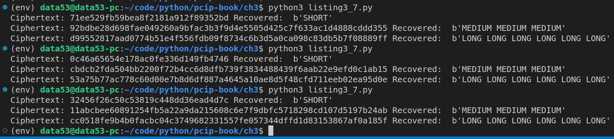

> EXERCISE 3.10: DETERMINISTIC OUTPUT 
> 
> Run the same inputs through AES-CBC using the same key and IV. You can use Listing 3-7 as 
> a starting point. Change the inputs to be the same each time and print out the corresponding 
> ciphertexts. What do you notice? 

--------------------------------

I only changed a single line from Listing 3-7. More specifically, I changed this 

```python 
for c in ciphertexts:
    print("Recovered", manager.decrypt_message(c))
```

to this: 

```python
for c in ciphertexts:
    print(f"Ciphertext: {c.hex()} Recovered: ", manager.decrypt_message(c))
```

When we run the new code, we get the following: 



One thing that we notice from the above screenshot is that, for a given plaintext 
we get different ciphertext if we vary the key and IV. 