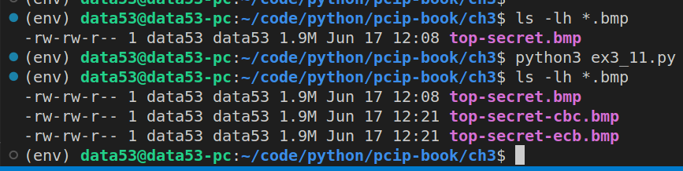
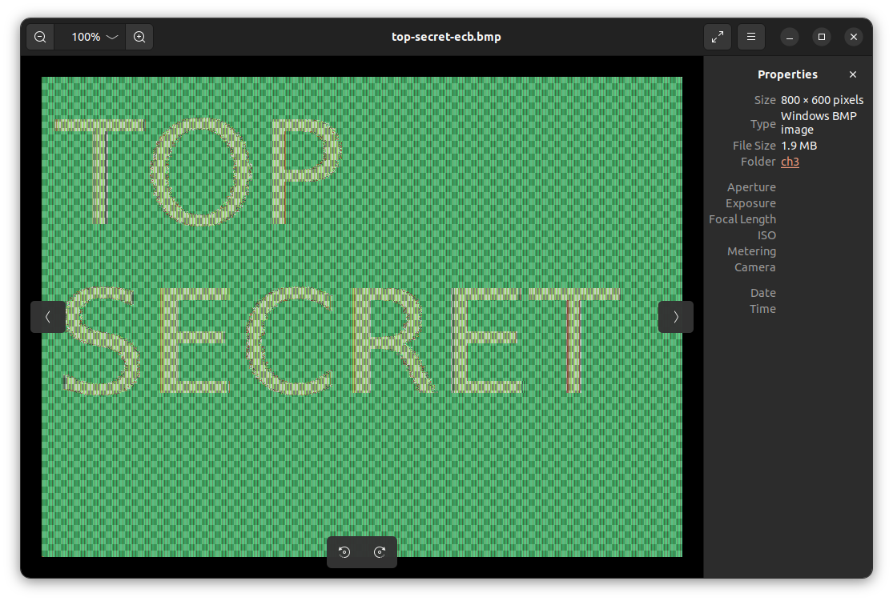
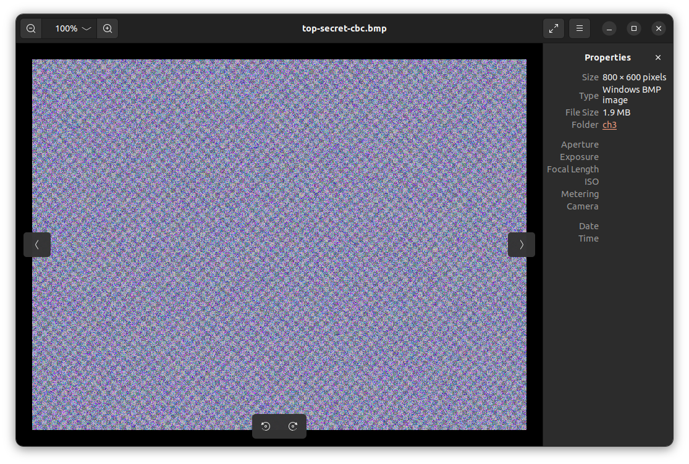

> EXERCISE 3.11: ENCRYPTING AN IMAGE
> 
> Encrypt the image that you encrypted with ECB mode earlier. What does the encrypted 
> image look like now? Don't forget to leave the first 54 bytes untouched!

--------------------------------

I created the following bmp file using GIMP: 


Then I wrote the following code to encrypt the above bmp file 
in both ECB and CBC mode. 

```python
# ex3_11.py

from cryptography.hazmat.primitives.ciphers import Cipher, algorithms, modes
from cryptography.hazmat.backends import default_backend
import os 

ifile = "top-secret.bmp"

key = os.urandom(16) # we are using AES-128 
iv = os.urandom(16) 

# first encrypt using ECB 
def encryptUsingECB(): 
    ofile = "top-secret-ecb.bmp"
    with open(ifile, "rb") as reader: 
        with open(ofile, "wb") as writer: 
            image_data = reader.read() 
            header, body = image_data[:54], image_data[54:]
            
            # now encrypt the body
            encryptor = Cipher(
                algorithm=algorithms.AES(key),
                mode=modes.ECB(),
                backend=default_backend()
            ).encryptor()

            # padding the body. 
            body += b"\x00"*(16 - (len(body)%16))

            writer.write(header + encryptor.update(body))


# then encrypt using CBC 
def encryptUsingCBC(): 
    ofile = "top-secret-cbc.bmp"
    with open(ifile, "rb") as reader: 
        with open(ofile, "wb") as writer: 
            image_data = reader.read() 
            header, body = image_data[:54], image_data[54:]
            
            # now encrypt the body
            encryptor = Cipher(
                algorithm=algorithms.AES(key),
                mode=modes.CBC(iv),
                backend=default_backend()
            ).encryptor()

            # padding the body. 
            body += b"\x00"*(16 - (len(body)%16))

            writer.write(header + encryptor.update(body))

if __name__ == '__main__': 
    encryptUsingECB()
    encryptUsingCBC()
```

Running the above code will generate two files as shown below: 



The following shows the encrypted versions of the above bmp file: 


