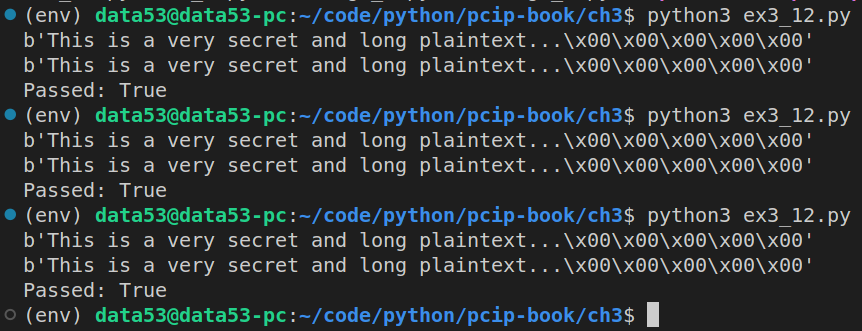

> EXERCISE 3.12: HAND-CRAFTED CBC 
> 
> ECB mode is just raw AES. You can create your own CBC Mode using ECB as the building 
> block (**Never use this for production code! Always use well-tested libraries**). For this 
> exercise, see if you can build a CBC encryption and decryption operation that is compatible 
> with the `cryptography` library. For encryption, remember to take the output of each block 
> and XOR it with the plaintext of the next block before encryption. Reverse the process for 
> decryption. 

--------------------------------

```python
# ex3_12.py 

from cryptography.hazmat.primitives.ciphers import Cipher, algorithms, modes
from cryptography.hazmat.backends import default_backend
import os 

class MyOwnCBC:
    def __init__(self, key: bytes, iv: bytes): 
        self.key = key 
        self.iv = iv 

    def encryptor(self): 
        return Encryptor(config=self) 
    
    def decryptor(self): 
        return Decryptor(config=self)

class Encryptor: 
    def __init__(self, config: MyOwnCBC):  
        self.config = config 
        self.buffer = b""
        self.previous_ciphertext = self.config.iv 
        self._encryptor = Cipher(
            algorithm=algorithms.AES(self.config.key), 
            mode=modes.ECB(), 
            backend=default_backend(),
        ).encryptor()

    def update(self, plaintext: bytes) -> bytes: 
        self.buffer += plaintext
        retval = b""  
        while len(self.buffer) >= 16:
            single_block = self.buffer[:16]
            self.buffer = self.buffer[16:]
            pre_cipher_block = xor_two_byte_strings(single_block, self.previous_ciphertext)
            self.previous_ciphertext = self._encryptor.update(pre_cipher_block) 
            retval += self.previous_ciphertext
        return retval
    
    def finalize(self): 
        assert(len(self.buffer) == 0)
        return b""  

class Decryptor: 
    def __init__(self, config: MyOwnCBC):  
        self.config = config 
        self.buffer = b""
        self.previous_ciphertext = self.config.iv 
        self._decryptor = Cipher(
            algorithm=algorithms.AES(self.config.key), 
            mode=modes.ECB(), 
            backend=default_backend(),
        ).decryptor()

    def update(self, ciphertext: bytes) -> bytes: 
        self.buffer += ciphertext
        retval = b""  
        while len(self.buffer) >= 16:
            single_block = self.buffer[:16]
            self.buffer = self.buffer[16:]
            pre_plaintext_block = self._decryptor.update(single_block) 
            retval += xor_two_byte_strings(pre_plaintext_block, self.previous_ciphertext)
            self.previous_ciphertext = single_block
        return retval
    
    def finalize(self): 
        assert(len(self.buffer) == 0)
        return b""  


# the following function is taken from Exercise 3.9. 
def xor_two_byte_strings(x: bytes, y: bytes) -> bytes: 
    assert(len(x) == len(y))
    
    result = []
    for _1, _2 in zip(x, y): 
        result.append(_1 ^ _2)
    return bytes(result)

if __name__ == '__main__': 
    key = os.urandom(32) 
    iv = os.urandom(16) 

    plaintext = b"This is a very secret and long plaintext..."
    # pad it up, so that the length of plaintext is a multiple of 16 bytes.
    plaintext = plaintext + b"\x00"*(16 - (len(plaintext)%16))

    my_cbc = MyOwnCBC(key=key, iv=iv) 
    my_cbc_encryptor = my_cbc.encryptor()
    my_cbc_decryptor = my_cbc.decryptor()

    ciphertext1 = my_cbc_encryptor.update(plaintext)
    print(my_cbc_decryptor.update(ciphertext=ciphertext1))

    official_cbc = Cipher(
        algorithm=algorithms.AES(key), 
        mode=modes.CBC(iv),
        backend=default_backend(),
    )
    official_cbc_encryptor = official_cbc.encryptor()
    official_cbc_decryptor = official_cbc.decryptor()

    ciphertext2 = official_cbc_encryptor.update(plaintext) 
    print(official_cbc_decryptor.update(ciphertext2))

    print(f"Passed: {ciphertext1 == ciphertext2}")
```

So, that is how you build your own AES-CBC!!

Running the above code, gives the following result: 



Also, note that the plaintext is 3 blocks long.