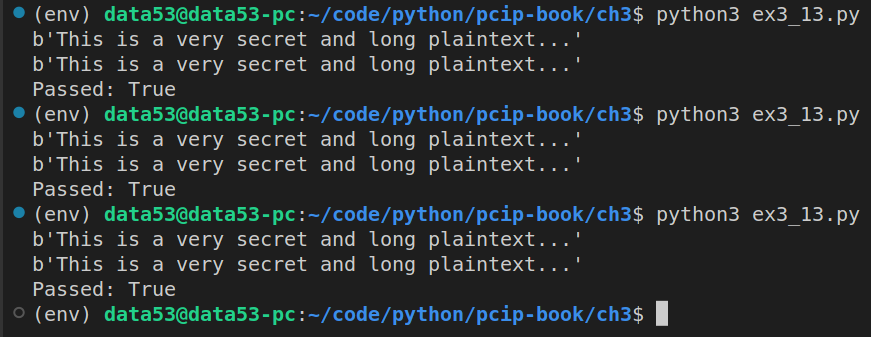

> EXERCISE 3.13: WRITE A SIMPLE COUNTER MODE 
> 
> As you did with CBC, create counter mode encryption from ECB mode. This 
> should be even easier that it was with CBC. Generate the key stream 
> by taking the IV block and encrypting it, then increasing the value of 
> the IV block by one to generate the next block of key stream material. When 
> finished, XOR the key stream with the plaintext. Decrypt in the same manner. 

--------------------------------

```python
# ex3_13.py 

from cryptography.hazmat.primitives.ciphers import Cipher, algorithms, modes
from cryptography.hazmat.backends import default_backend
import os 

AES_BLOCK_SIZE_IN_BYTES = 16
AES_BLOCK_SIZE_IN_BITS = 128

class MyOwnCTR:
    def __init__(self, key: bytes, nonce: bytes): 
        assert(len(nonce) == AES_BLOCK_SIZE_IN_BYTES)
        self.key = key 
        self.nonce = nonce 

    def encryptor(self): 
        return Encryptor(config=self) 
    
    def decryptor(self): 
        # Note that in CTR, encryption and decryption are exactly the same operations. 
        return Encryptor(config=self)
    
class Encryptor: 
    def __init__(self, config: MyOwnCTR):  
        self.config = config 
        self.current_nonce = self.config.nonce
        self._encryptor = Cipher(
            algorithm=algorithms.AES(self.config.key), 
            mode=modes.ECB(), 
            backend=default_backend(),
        ).encryptor()
        self.e_current_nonce = self._encryptor.update(self.current_nonce)
        self.buffer = b''

    def update(self, plaintext: bytes) -> bytes: 
        self.buffer += plaintext
        retval = b""  
        while len(self.buffer) > 0:
            if len(self.e_current_nonce) == 0: 
                self.current_nonce = increment_the_nonce(nonce=self.current_nonce)
                self.e_current_nonce = self._encryptor.update(self.current_nonce)
            k = min(
                len(self.buffer), 
                len(self.e_current_nonce),
            )
            retval += xor_two_byte_strings(
                self.buffer[:k],
                self.e_current_nonce[:k],
            )
            self.buffer = self.buffer[k:]
            self.e_current_nonce = self.e_current_nonce[k:]
        return retval
    
    def finalize(self): 
        assert(len(self.buffer) == 0)
        return b"" 

def increment_the_nonce(nonce: bytes) -> bytes: 
    nonce = (int.from_bytes(nonce,'big') + 1)%(2**128)
    return int.to_bytes(nonce, length=16, byteorder='big')

# the following function is taken from Exercise 3.9. 
def xor_two_byte_strings(x: bytes, y: bytes) -> bytes: 
    assert(len(x) == len(y))
    
    result = []
    for _1, _2 in zip(x, y): 
        result.append(_1 ^ _2)
    return bytes(result)

if __name__ == '__main__': 
    key = os.urandom(32) 
    nonce = os.urandom(16) 

    plaintext = b"This is a very secret and long plaintext..."

    my_ctr = MyOwnCTR(key=key, nonce=nonce) 
    my_ctr_encryptor = my_ctr.encryptor()
    my_ctr_decryptor = my_ctr.decryptor()

    ciphertext1 = my_ctr_encryptor.update(plaintext)
    print(my_ctr_decryptor.update(ciphertext1))

    official_ctr = Cipher(
        algorithm=algorithms.AES(key), 
        mode=modes.CTR(nonce),
        backend=default_backend(),
    )
    official_ctr_encryptor = official_ctr.encryptor()
    official_ctr_decryptor = official_ctr.decryptor()

    ciphertext2 = official_ctr_encryptor.update(plaintext) 
    print(official_ctr_decryptor.update(ciphertext2))

    print(f"Passed: {ciphertext1 == ciphertext2}")
```

And that is how we create our own CTR mode from ECB mode. 

Note that in the above code we didn't need padding of the `plaintext`.

When we run the above code we get the following: 

