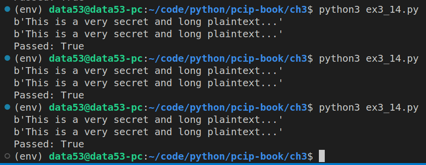

> EXERCISE 3.14: PARALLEL COUNTER MODE 
> 
> Extend your counter mode implementation to use a thread pool 
> to generate the key stream in parallel. Remember that to generate 
> a block of key stream, all that is required is the starting IV 
> and which block of key stream is being generated (e.g., 0 for the 
> first 16-byte block, 1 for the second 16-byte block, etc.). Start
> by creating a function that can generate _any_ particular block 
> of key stream, perhaps something like `keystream(IV, i)`. Next, 
> parallelize the generation of a key stream up to _n_ by dividing 
> the counter sequence among independent processes any way you please, 
> and have them all work on generating their key stream blocks independently. 

--------------------------------

The following is a parallel version of the code in the previous question. 

I used `concurrent.futures.ThreadPoolExecutor` to parallelize. 

```python
# ex3_14.py 

from cryptography.hazmat.primitives.ciphers import Cipher, algorithms, modes
from cryptography.hazmat.backends import default_backend
import os 
import concurrent.futures


AES_BLOCK_SIZE_IN_BYTES = 16
AES_BLOCK_SIZE_IN_BITS = 128
NUMBER_OF_KEYSTREAM_BLOCKS_TO_GENERATE_AT_ONCE = 30
MAX_NUMBER_OF_WORKERS = 6

class MyOwnCTR:
    def __init__(self, key: bytes, nonce: bytes): 
        assert(len(nonce) == AES_BLOCK_SIZE_IN_BYTES)
        self.key = key 
        self.nonce = nonce 

    def encryptor(self): 
        return Encryptor(config=self) 
    
    def decryptor(self): 
        # Note that in CTR, encryption and decryption are exactly the same operations. 
        return Encryptor(config=self)
    
class Encryptor: 
    def __init__(self, config: MyOwnCTR):  
        self.config = config 
        self.keystream = []
        self.current_index = 0 
        self.e_current_nonce = b"" 
        self.buffer = b""

        self._encryptor = Cipher(
            algorithm=algorithms.AES(self.config.key), 
            mode=modes.ECB(), 
            backend=default_backend(),
        ).encryptor()
    
    def advance(self): 
        if len(self.keystream) > 0: 
            self.e_current_nonce = self.keystream[0] 
            del self.keystream[0] 
            return
        
        # since the keystream is empty, let's populate it. 
        with concurrent.futures.ThreadPoolExecutor(max_workers=MAX_NUMBER_OF_WORKERS) as executor: 
            future_to_index = dict()

            for i in range(NUMBER_OF_KEYSTREAM_BLOCKS_TO_GENERATE_AT_ONCE): 
                fut = executor.submit(self.get_the_ith_keyblock, self.config.nonce, self.current_index)
                future_to_index[fut] = i
                self.current_index += 1 
            
            result_to_index = []

            for future in concurrent.futures.as_completed(future_to_index): 
                i = future_to_index[future]
                keyblock = future.result() 
                result_to_index.append((keyblock,i))
            
            result_to_index.sort(key=lambda x: x[1])
            for t in result_to_index: 
                self.keystream.append(t[0])        

        self.e_current_nonce = self.keystream[0] 
        del self.keystream[0] 
        return
  
    def update(self, plaintext: bytes) -> bytes: 
        self.buffer += plaintext
        retval = b""  
        while len(self.buffer) > 0:
            if len(self.e_current_nonce) == 0: 
                self.advance()
            k = min(
                len(self.buffer), 
                len(self.e_current_nonce),
            )
            retval += xor_two_byte_strings(
                self.buffer[:k],
                self.e_current_nonce[:k],
            )
            self.buffer = self.buffer[k:]
            self.e_current_nonce = self.e_current_nonce[k:]
        return retval
    
    def finalize(self): 
        assert(len(self.buffer) == 0)
        return b"" 

    def get_the_ith_keyblock(self, nonce: bytes, i: int) -> bytes: 
        # get the i th nonce
        i_th_nonce = (int.from_bytes(nonce,'big') + i)%(2**128)
        i_th_nonce = int.to_bytes(i_th_nonce, length=16, byteorder='big')
        return self._encryptor.update(i_th_nonce)

# the following function is taken from Exercise 3.9. 
def xor_two_byte_strings(x: bytes, y: bytes) -> bytes: 
    assert(len(x) == len(y))
    
    result = []
    for _1, _2 in zip(x, y): 
        result.append(_1 ^ _2)
    return bytes(result)

if __name__ == '__main__': 
    key = os.urandom(32) 
    nonce = os.urandom(16) 

    plaintext = b"This is a very secret and long plaintext..."

    my_ctr = MyOwnCTR(key=key, nonce=nonce) 
    my_ctr_encryptor = my_ctr.encryptor()
    my_ctr_decryptor = my_ctr.decryptor()

    ciphertext1 = my_ctr_encryptor.update(plaintext)
    print(my_ctr_decryptor.update(ciphertext1))

    official_ctr = Cipher(
        algorithm=algorithms.AES(key), 
        mode=modes.CTR(nonce),
        backend=default_backend(),
    )
    official_ctr_encryptor = official_ctr.encryptor()
    official_ctr_decryptor = official_ctr.decryptor()

    ciphertext2 = official_ctr_encryptor.update(plaintext) 
    print(official_ctr_decryptor.update(ciphertext2))

    print(f"Passed: {ciphertext1 == ciphertext2}")
```

Running the above code gives the following result: 

