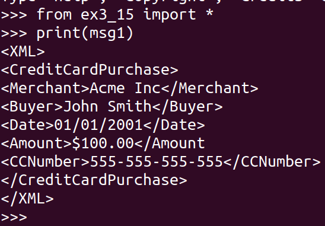
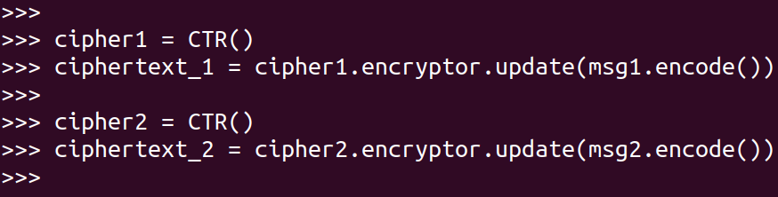
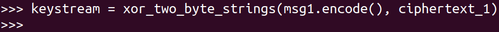
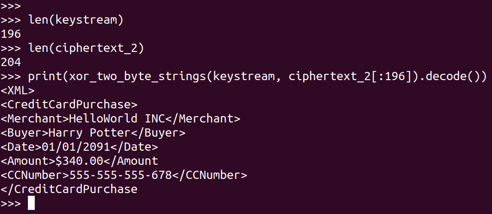

> EXERCISE 3.15: RIDING THE KEYSTREAM 
> 
> Put into practice this keystream-stealing attack. That is, encrypt two different 
> purchase messages using the same key and IV. "Intercept" one of the two messages and 
> XOR the ciphertext contents with the known plaintext. This will give you a keystream. 
> Next, XOR the keystream with the other message to recover that message's plaintext. The message
> sizes may be a little different, but if you're short some keystream bytes, recover what you can. 

--------------------------------

Suppose the following code is inside of a file called `ex3_15.py`.

```python
# ex3_15.py

from cryptography.hazmat.primitives.ciphers import Cipher, algorithms, modes
from cryptography.hazmat.backends import default_backend
import os 

class CTR: 
    def __init__(self): 
        self.preshared_key = bytes.fromhex("6ae8ec45144e0e1f7557c47e0414b5e4")
        self.preshared_iv = bytes.fromhex("0156b06a05b32e0da4b84e20bbb8e2a6")

        self.aesContext = Cipher(
            algorithm=algorithms.AES(self.preshared_key),
            mode=modes.CTR(self.preshared_iv), 
            backend=default_backend(),
        )
        self.encryptor = self.aesContext.encryptor()
        self.decryptor = self.aesContext.decryptor() 

def generate_msg(merchant: str, buyer: str, date: str, amount: str, cc: str): 
    return "<XML>\n"\
    "<CreditCardPurchase>\n"\
    f"<Merchant>{merchant}</Merchant>\n"\
    f"<Buyer>{buyer}</Buyer>\n"\
    f"<Date>{date}</Date>\n"\
    f"<Amount>{amount}</Amount\n"\
    f"<CCNumber>{cc}</CCNumber>\n"\
    "</CreditCardPurchase>\n"\
    "</XML>"

msg1 = generate_msg(
    merchant="Acme Inc", 
    buyer="John Smith", 
    date="01/01/2001", 
    amount="$100.00", 
    cc="555-555-555-555"
)

msg2 = generate_msg(
    merchant="HelloWorld INC", 
    buyer="Harry Potter", 
    date="01/01/2091", 
    amount="$340.00", 
    cc="555-555-555-678"
)


# the following function is taken from Exercise 3.9. 
def xor_two_byte_strings(x: bytes, y: bytes) -> bytes: 
    assert(len(x) == len(y))
    
    result = []
    for _1, _2 in zip(x, y): 
        result.append(_1 ^ _2)
    return bytes(result)
```

Now, open up an interactive python interpreter and import it: 


Then encrypt `msg1` and `msg2` using AES-CTR: 


Suppose now, the attacker knows `msg1` and `ciphertext_1`. Thus 
he can generate the beginning parts of the keystream as follows: 


The following screenshot shows how the attacker can hack into 
`ciphertext_2` (or at least the first 196 bytes of it).


Since the attacker knows the first 196 bytes of the keystream, he can 
hack into the first 196 bytes of any ciphertext that gets encrypted by the 
`CTR` class given above.

Note that the major flaw in this operation was that the programmers used
the same key/IV pair for encrypting two different messages. 