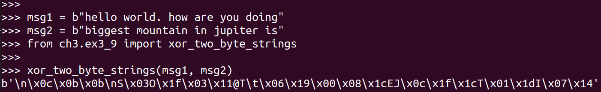
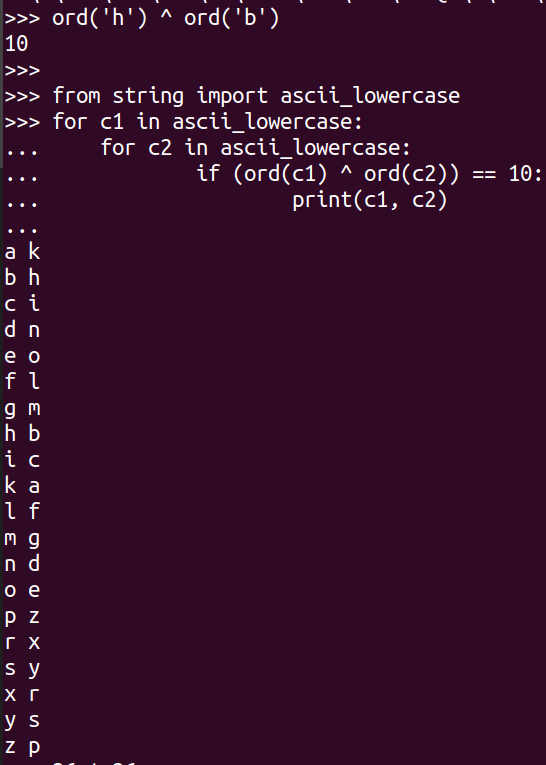

> EXERCISE 3.16: SIFTING THROUGH XOR 
> 
> XOR together some plaintext messages and look around for patterns and readable data. 
> There's no need to use any encryption for this, just take some regular, human-readable
> messages and XOR the bytes. Try human-readable strings, XML, JSON, and other formats. You 
> may not find a lot that is instantly decipherable, but it's a fun exercise. 

--------------------------------

The following picture shows XORing two plaintext messages: 

It is very hard for the attacker to get `msg1` and `msg2` from the 
XOR. For example, the first byte of `msg1` is `h` and the first byte 
of `msg2` is `b`. XOR of their ASCII values gives 10. If you try to XOR 
every pair of lowercase letters ($26 \times 26 = 676$ pairs) and check if 
they give a value of 10, you will find 20 possibilities. They are: 

Bottom line, don't reuse key/IV pair. 