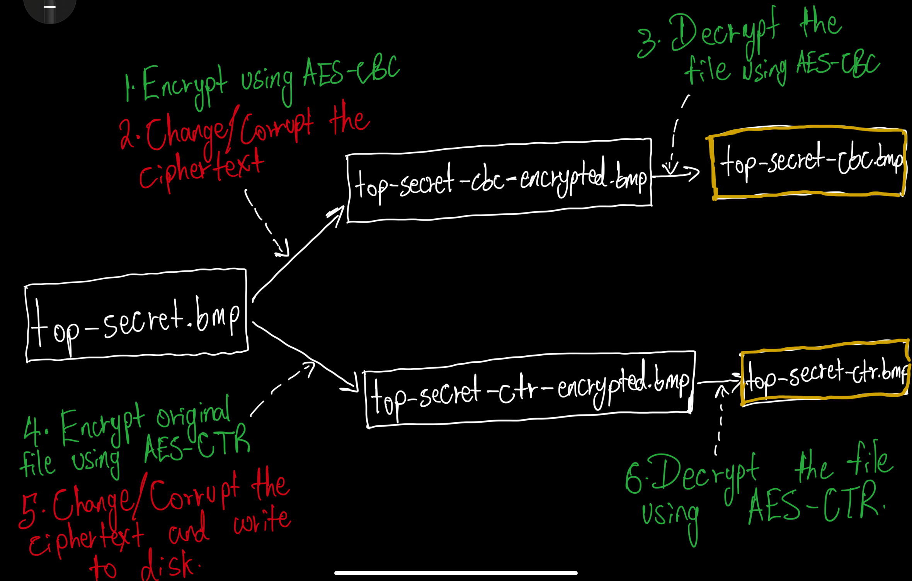
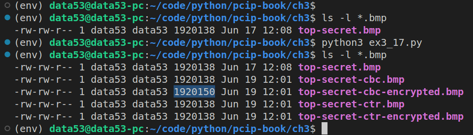
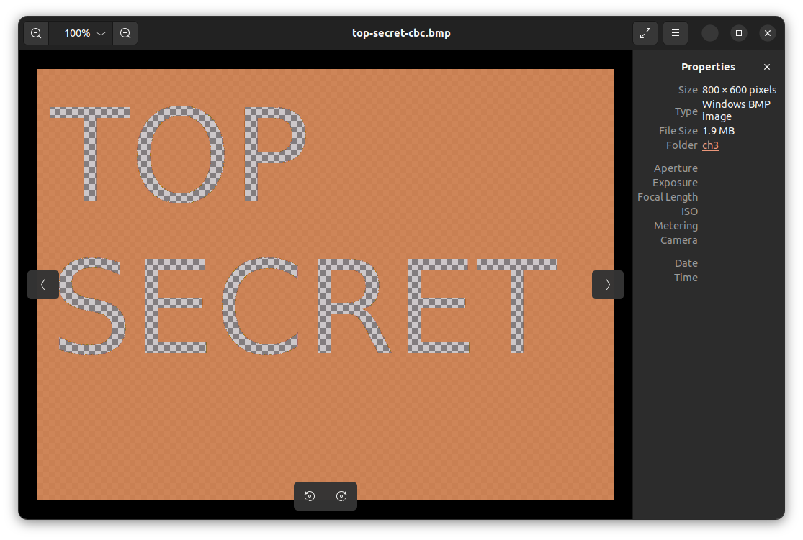
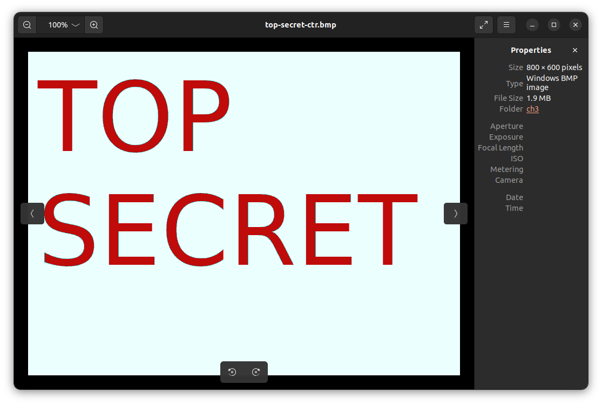

> EXERCISE 3.17: VISUALIZING CIPHERTEXT CHANGES 
> 
> To better understand the difference between counter mode and cipher block chaining mode, 
> go back to the image encryption utility you wrote previously. Modify it to first 
> encrypt and then decrypt the image, using either AES-CBC or AES-CTR as the mode. After 
> decryption, the original image should be completely restored.  
> 
> Now introduce an error into the ciphertext and decrypt the modified bytes. Try, for example, 
> picking the byte right in the middle of the encrypted image data and setting it to 0. After
> corrupting the data, call the decryption function and view the restored image. How much of 
> a difference did the edit make with CTR? How much of a difference did the edit make with 
> CBC? 
> 
> HINT: If you can't see anything, try an all-white image. If you still can't see it, change 
> 50 bytes or so to figure out where the changes are happening. Once you find where the changes 
> are happening, go back to changing a single byte to view the differences between CTR 
> and CBC. Can you explain what's happening? 

--------------------------------

Remember the following `top-secret.bmp` file from Exercise 3.11?


The following picture shows what we are going to do next. 



The following code first encrypts `top-secret.bmp`, introduces an error 
and then decrypts the corrupted ciphertext. 

```python
# ex3_17.py

from cryptography.hazmat.primitives.ciphers import Cipher, algorithms, modes
from cryptography.hazmat.backends import default_backend
from cryptography.hazmat.primitives import padding 
import os 

BLOCK_SIZE_OF_AES = 128 # bits

key = os.urandom(16) # we are using AES-128 
iv = os.urandom(16) 

def encryptUsingCBCAndThenCorruptIt():
    ifile = "top-secret.bmp" 
    ofile = "top-secret-cbc-encrypted.bmp"
    with open(ifile, "rb") as reader: 
        with open(ofile, "wb") as writer: 
            image_data = reader.read() 
            header, body = image_data[:54], image_data[54:]
            
            # Pad the body
            padder = padding.PKCS7(BLOCK_SIZE_OF_AES).padder()
            body_padded = padder.update(body)
            body_padded += padder.finalize()

            # Encrypt the body
            encryptor = Cipher(
                algorithm=algorithms.AES(key),
                mode=modes.CBC(iv),
                backend=default_backend()
            ).encryptor()
            ciphertext = header + encryptor.update(body_padded)
            ciphertext += encryptor.finalize() 

            # Corrupt the ciphertext
            ciphertext = corruptCipherText(ciphertext=ciphertext)

            # Write the ciphertext to disk. 
            writer.write(ciphertext)

def decryptUsingCBC(): 
    ifile = "top-secret-cbc-encrypted.bmp"
    ofile = "top-secret-cbc.bmp"
    with open(ifile, "rb") as reader: 
        with open(ofile, "wb") as writer: 
            image_data = reader.read() 
            header, body_encrypted = image_data[:54], image_data[54:]
            
            # Decrypt the body
            decryptor = Cipher(
                algorithm=algorithms.AES(key),
                mode=modes.CBC(iv),
                backend=default_backend()
            ).decryptor()
            body_padded = decryptor.update(body_encrypted)
            body_padded += decryptor.finalize() 

            # Remove the padding bytes.
            unpadder = padding.PKCS7(BLOCK_SIZE_OF_AES).unpadder()
            body = unpadder.update(body_padded)
            body += unpadder.finalize() 

            # Write the plaintext to disk. 
            writer.write(header + body)

def encryptUsingCTRAndThenCorruptIt():
    ifile = "top-secret.bmp" 
    ofile = "top-secret-ctr-encrypted.bmp"
    with open(ifile, "rb") as reader: 
        with open(ofile, "wb") as writer: 
            image_data = reader.read() 
            header, body = image_data[:54], image_data[54:]

            # Encrypt the body
            encryptor = Cipher(
                algorithm=algorithms.AES(key),
                mode=modes.CTR(iv),
                backend=default_backend()
            ).encryptor()
            ciphertext = header + encryptor.update(body)
            ciphertext += encryptor.finalize() 

            # Corrupt the ciphertext
            ciphertext = corruptCipherText(ciphertext=ciphertext)

            # Write the ciphertext to disk. 
            writer.write(ciphertext)

def decryptUsingCTR(): 
    ifile = "top-secret-ctr-encrypted.bmp"
    ofile = "top-secret-ctr.bmp"
    with open(ifile, "rb") as reader: 
        with open(ofile, "wb") as writer: 
            image_data = reader.read() 
            header, body = image_data[:54], image_data[54:]
            
            # Decrypt the body
            decryptor = Cipher(
                algorithm=algorithms.AES(key),
                mode=modes.CTR(iv),
                backend=default_backend()
            ).decryptor()
            plaintext = header + decryptor.update(body)
            plaintext += decryptor.finalize() 

            # Write the plaintext to disk. 
            writer.write(plaintext)


def corruptCipherText(ciphertext: bytes)->bytes: 
    '''
    This function changes the 54th byte of ciphertext to 0xff.
    '''
    k = 54 
    ciphertext = ciphertext[:k] + b"\xff" + ciphertext[k+1:]
    return ciphertext

if __name__ == '__main__': 
    # CBC operation
    encryptUsingCBCAndThenCorruptIt()
    decryptUsingCBC()

    # CTR operation
    encryptUsingCTRAndThenCorruptIt()
    decryptUsingCTR()
```

So let's run the above code: 



`top-secret-cbc.bmp` and `top-secret-ctr.bmp` are shown below: 




It is amazing how changing a single byte in the ciphertext, can have 
such dramatic color changes. 

Note that: when you rerun the above code (i.e. `ex3_17.py`) you might get 
different effects since the `key` and `iv` are generated randomly on each 
run. 