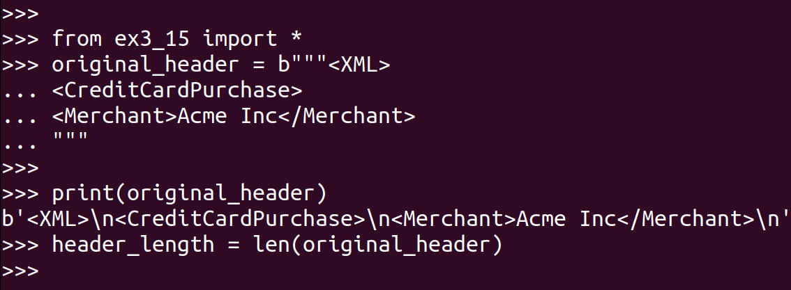
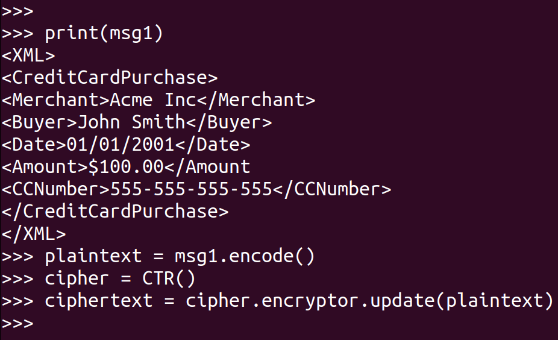
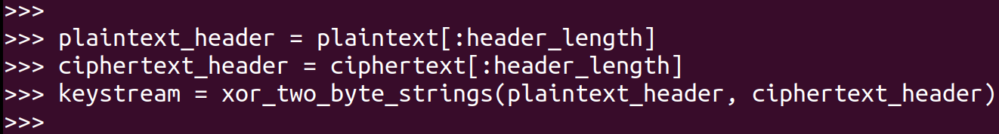
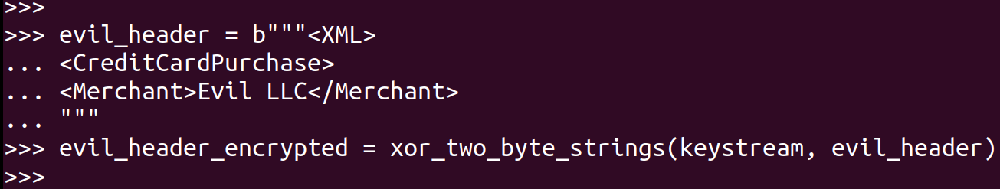
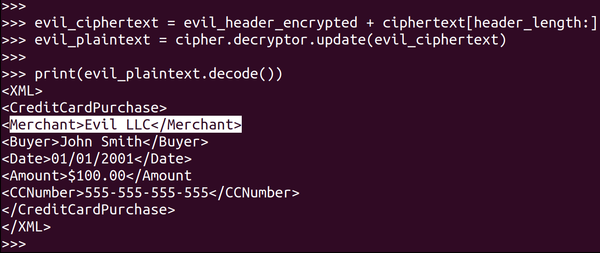

> EXERCISE 3.18: EMBRACING EVIL 
> 
> You work for (or own!) Evil LLC. Time to steal some payments from Acme. Start 
> with one of the encrypted payment messages you created in the earlier exercises. 
> Calculate the size of the header up through the identification of the merchant and 
> extract that many bytes of the encrypted data. XOR the plaintext header with the 
> ciphertext header to get the _keystream_. Once you have this, XOR the extracted 
> keystream with a header identifying Evil LLC as the merchant. This is the "evil"
> ciphertext. Copy it over the bytes of the encrypted file to create a new payment message
> identifying your company as the recipient. Prove that it works by decrypting the modified 
> file. 

--------------------------------

Before doing this question, I recommend that you do [Exercise 3.15](3.15.md)
they are very similar. In fact we are going to use the code given there as a library. 

First, find & define your `original_header` and calculate the length of the header. 

Define your `plaintext` and `ciphertext`: 

XOR the plaintext header with the ciphertext header to get the _keystream_: 

Once you have this, XOR the extracted keystream with a header identifying 
Evil LLC as the merchant. This is the "evil" ciphertext.

Copy the "evil" header over the bytes of the encrypted file to create a new payment message
identifying your company as the recipient. Prove that it works by decrypting the modified 
file.

