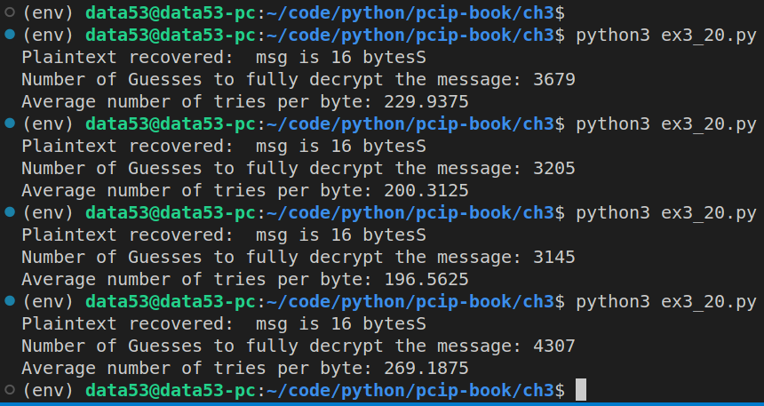

> EXERCISE 3.20: STATISTICS ARE ALSO FUTILE 
> 
> Instrument your padding oracle attack in the previous exercise to calculate how many 
> guesses it took to fully decrypt the entire message and calculate an average number of 
> tries per byte. In theory, it should work out to about 256 tries per byte. But you're 
> probably working with such small numbers that it will vary widely. In our tests on a 
> $96$-byte message, our averages varied between about $220$ guesses per byte and $290$ 
> guesses per byte. 

--------------------------------

```python
# ex3_20.py

from cryptography.hazmat.primitives.ciphers import Cipher, algorithms, modes
from cryptography.hazmat.backends import default_backend
from cryptography.hazmat.primitives import padding
import os

def sslv3Pad(msg): 
    padNeeded = (16 - (len(msg) % 16)) - 1
    padding = padNeeded.to_bytes(padNeeded+1, "big")
    return msg + padding 

def sslv3Unpad(padded_msg): 
    paddingLen = padded_msg[-1] + 1 
    return padded_msg[:-paddingLen]

class Oracle:
    '''
    The Oracle class basically models the SSLv3 Servers. 
    '''
    def __init__(self, key, iv):
        self.key = key
        self.iv = iv

    def accept(self, ciphertext) -> bool:
        aesCipher = Cipher(algorithms.AES(self.key),
                           modes.CBC(self.iv),
                           backend=default_backend())
        decryptor = aesCipher.decryptor()
        plaintext = decryptor.update(ciphertext)
        plaintext += decryptor.finalize()
        return plaintext[-1] == 15

    def update_key_and_iv(self, ciphertext) -> bytes: 
        '''
        Change the key & iv that ciphertext was created. 
        '''
        aesCipher = Cipher(algorithms.AES(self.key),
                           modes.CBC(self.iv),
                           backend=default_backend())
        decryptor = aesCipher.decryptor()
        plaintext = decryptor.update(ciphertext)
        plaintext += decryptor.finalize()

        self.key = os.urandom(16)
        self.iv = os.urandom(16)

        aesCipher = Cipher(algorithms.AES(self.key),
                           modes.CBC(self.iv),
                           backend=default_backend())
        encryptor = aesCipher.encryptor() 
        ciphertext = encryptor.update(plaintext)
        ciphertext += encryptor.finalize()
        return ciphertext  


    def right_shift_plaintext(self,ciphertext: bytes) -> bytes: 
        aesCipher = Cipher(algorithms.AES(self.key),
                           modes.CBC(self.iv),
                           backend=default_backend())
        decryptor = aesCipher.decryptor()
        plaintext = decryptor.update(ciphertext)
        plaintext += decryptor.finalize()

        plaintext = b"-" + plaintext[:-17] + plaintext[-16:]
        
        encryptor = aesCipher.encryptor() 
        _ciphertext = encryptor.update(plaintext) 
        _ciphertext += encryptor.finalize()
        return _ciphertext 
    
    @staticmethod
    def start_experiment(): 
        msg = b"msg is 16 bytesS"
        msg_padded = sslv3Pad(msg) 

        o = Oracle(key=os.urandom(16), iv=os.urandom(16))
        aesCipher = Cipher(algorithms.AES(o.key),
                           modes.CBC(o.iv),
                           backend=default_backend())
        encryptor = aesCipher.encryptor() 
        ciphertext = encryptor.update(msg_padded)
        ciphertext += encryptor.finalize() 
        assert(o.accept(ciphertext=ciphertext))
        return ciphertext, o 
        

# This function assumes that the last cipher text block is a full
# block of SSLV3 padding
def lucky_get_one_byte(iv, ciphertext, block_number, oracle):
    block_start = block_number * 16
    block_end = block_start + 16
    block = ciphertext[block_start:block_end]

    # Copy the block over the last block.
    mod_ciphertext = ciphertext[:-16] + block
    if not oracle.accept(mod_ciphertext):
        return False, None

    # This is valid! Let's get the byte!
    # We first need the byte decrypted from the block.
    # It was XORed with second to last block, so
    # byte = 15 XOR (last byte of second-to-last block).
    second_to_last = ciphertext[-32:-16]
    intermediate = second_to_last[-1]^15

    # We still have to XOR it with its *real*
    # preceding block in order to get the true value.
    if block_number == 0:
        prev_block = iv
    else:
        prev_block = ciphertext[block_start-16:block_start]

    return True, intermediate ^ prev_block[-1]
    
if __name__ == '__main__': 
    ciphertext, o = Oracle.start_experiment() 
    plaintext_recovered = []
    # let's suppose the attacker knows that the plaintext is 16 characters/bytes long. 
    length_of_plaintext_length = 16 
    number_of_guesses = 0 
    while length_of_plaintext_length > 0:
        number_of_guesses += 1  
        status, byte = lucky_get_one_byte(iv=o.iv, ciphertext=ciphertext, block_number=0, oracle=o) 
        if (status): 
            plaintext_recovered.append(byte)
            ciphertext = o.right_shift_plaintext(ciphertext=ciphertext)
            length_of_plaintext_length -= 1
        else: 
            ciphertext = o.update_key_and_iv(ciphertext=ciphertext)
        

    plaintext_recovered.reverse()
    print("Plaintext recovered: ", bytes(plaintext_recovered).decode())
    print(f"Number of Guesses to fully decrypt the message: {number_of_guesses}")
    print(f"Average number of tries per byte: {number_of_guesses/16}") # since there are 16 bytes in plaintext
```

Running the above code gives us the following: 


