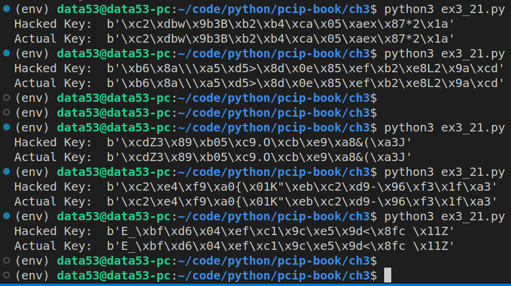

> EXERCISE 3.21: PREDICTING TIME-BASED RANDOMNESS
> 
> Write an AES encryption program (or modify one of the others you've written 
> for this chapter) that uses Python random number generator to generate keys. 
> Use the seed method to explicitly configure the generator based on the current 
> time using `time.time()` rounded to the nearest second. Then use this generator
> to create a key and encrypt some data. Write a separate program that takes 
> the encrypted data as input and tries to guess the key. It should take a minimum 
> time and a maximum time as a range and try iterating between these two points as 
> seed values for random. 

--------------------------------

```python
# ex3_21.py 

from cryptography.hazmat.primitives.ciphers import Cipher, algorithms, modes
from cryptography.hazmat.backends import default_backend
from cryptography.hazmat.primitives import padding
import os
import random
import time 

def encrypt_msg(msg: bytes) -> dict: 
    current_time = round(time.time()) # rounded to the nearest second
    r = random.Random(current_time)

    key = r.getrandbits(128).to_bytes(16, 'big')
    iv  = r.getrandbits(128).to_bytes(16, 'big')
    
    aesCipher = Cipher(
        algorithm=algorithms.AES(key=key),
        mode=modes.CTR(nonce=iv),
        backend=default_backend(),
    )
    encryptor = aesCipher.encryptor() 
    return {
        "msg": msg, 
        "encrypted-msg": encryptor.update(msg) + encryptor.finalize(), 
        "key": key, 
        "iv": iv, 
        "current_time": current_time, 
    }

def hack_encrypted_msg(encrypted_msg: bytes, min_time: int, max_time: int, msg: bytes): 
    for possible_seed in range(min_time, max_time + 1): 
        r = random.Random(possible_seed)
        possible_key = r.getrandbits(128).to_bytes(16, 'big')
        possible_iv = r.getrandbits(128).to_bytes(16, 'big')

        aesCipher = Cipher(
            algorithm=algorithms.AES(key=possible_key),
            mode=modes.CTR(nonce=possible_iv),
            backend=default_backend(),
        )
        decryptor = aesCipher.decryptor() 
        possible_msg = decryptor.update(encrypted_msg)
        possible_msg += decryptor.finalize() 

        if (possible_msg == msg): 
            # we have a hit. 
            return possible_key 

if __name__ == '__main__': 
    msg = b'hello world how are you doing'
    result = encrypt_msg(
        msg=msg,
    )
    print("Hacked Key: ", hack_encrypted_msg(
        encrypted_msg=result['encrypted-msg'], 
        min_time=result['current_time']-30,
        max_time=result['current_time'] + 30, 
        msg=msg,
    ))

    print("Actual Key: ", result['key`'])

```



Moral of the story: 
1. Cryptographic keys should have enough randomness in them. Otherwise they are useless. 