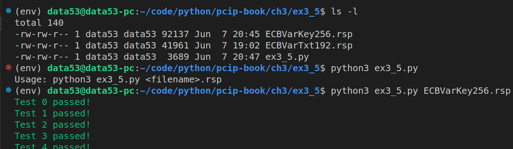
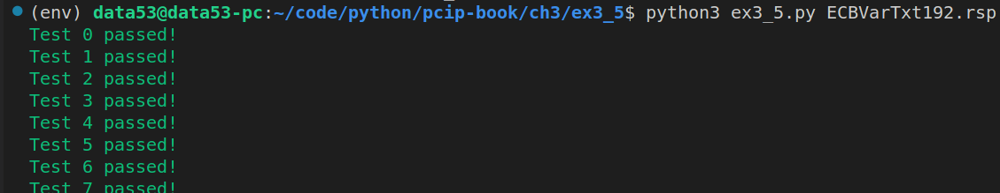

> EXERCISE 3.5: ALL NIST KATS
> 
> Write a program that will read one of these NIST KAT "rsp" files, and parse
> out the encryption and decryption KATs. Test and validate your AES library 
> on all vectors on a couple of ECB test files. 

--------------------------------

```python
# ex3_5.py 

from cryptography.hazmat.primitives.ciphers import Cipher, algorithms, modes
from cryptography.hazmat.backends import default_backend
from colorama import Fore, Style 
import sys 
import os 

def encrypt_using_aes_ecb(plaintext: bytes, key: bytes) -> bytes: 
    aesCipher = Cipher(algorithms.AES(key), modes.ECB(), backend=default_backend())
    aesEncryptor = aesCipher.encryptor()
    ciphertext = aesEncryptor.update(plaintext)
    return ciphertext 

def decrypt_using_aes_ecb(ciphertext: bytes, key: bytes) -> bytes: 
    aesCipher = Cipher(algorithms.AES(key), modes.ECB(), backend=default_backend())
    aesDecryptor = aesCipher.decryptor()
    plaintext = aesDecryptor.update(ciphertext)
    return plaintext

class ASingleKAT:
    def __init__(self, count: int, key: bytes, plaintext: bytes, ciphertext: bytes):
        self.count = count
        self.key = key
        self.plaintext = plaintext 
        self.ciphertext = ciphertext 
    
    def testInEncryptMode(self): 
        result = encrypt_using_aes_ecb(plaintext=self.plaintext, key=self.key)
        if result == self.ciphertext: 
            print(Fore.GREEN + f"Test {self.count} passed!")
            print(Style.RESET_ALL, end='')
        else: 
            print(Fore.RED + f"Test {self.count} Failed!")
            print(Style.RESET_ALL, end='')
            
    def testInDecryptMode(self): 
        result = decrypt_using_aes_ecb(ciphertext=self.ciphertext, key=self.key)
        if result == self.plaintext: 
            print(Fore.GREEN + f"Test {self.count} passed!")
            print(Style.RESET_ALL, end='')
        else: 
            print(Fore.RED + f"Test {self.count} Failed!")
            print(Style.RESET_ALL, end='')
    
    @staticmethod 
    def correctType(kat: dict[str,str]): 
        kat['count'] = int(kat['count'])
        kat['key'] = bytes.fromhex(kat['key'])
        kat['plaintext'] = bytes.fromhex(kat['plaintext'])
        kat['ciphertext'] = bytes.fromhex(kat['ciphertext'])

if __name__ == '__main__':
    if len(sys.argv) != 2: 
        print(f"Usage: python3 {sys.argv[0]} <filename>.rsp")
        exit(-1) 
    filename = sys.argv[1]
    if not os.path.exists(filename): 
        print(f"File {filename} does not exist!")
        exit(-1) 
    with open(filename, 'r') as f: 
        encrypt_mode = True

        while True:
            single_line = f.readline() 
            if single_line == '': 
                # end of file is reached. 
                break 
            if single_line.startswith('#'): 
                # this line is a comment. So ignore it. 
                continue 
            single_line = single_line.strip() 
            if len(single_line) == 0: 
                # this line is an empty line. 
                continue 
            if single_line == "[ENCRYPT]": 
                encrypt_mode = True 
                continue 
            if single_line == "[DECRYPT]": 
                encrypt_mode = False 
                continue 
            if single_line.startswith('COUNT'):
                kat = { 
                    "count": None, 
                    "key": None, 
                    "plaintext": None, 
                    "ciphertext": None, 
                } 
                for _ in range(4):
                    data = list(map(lambda x:x.strip(), single_line.split('=')))
                    kat[data[0].lower()] = data[1]
                    single_line = f.readline() 
                ASingleKAT.correctType(kat=kat)
                kat = ASingleKAT(**kat)
                if encrypt_mode: 
                    kat.testInEncryptMode()
                else: 
                    kat.testInDecryptMode()
```

The beginning of these NIST KAT files look as follows: 

```
# CAVS 11.1
# Config info for aes_values
# AESVS VarKey test data for ECB
# State : Encrypt and Decrypt
# Key Length : 256
# Generated on Fri Apr 22 15:11:30 2011

[ENCRYPT]

COUNT = 0
KEY = 8000000000000000000000000000000000000000000000000000000000000000
PLAINTEXT = 00000000000000000000000000000000
CIPHERTEXT = e35a6dcb19b201a01ebcfa8aa22b5759

COUNT = 1
KEY = c000000000000000000000000000000000000000000000000000000000000000
PLAINTEXT = 00000000000000000000000000000000
CIPHERTEXT = b29169cdcf2d83e838125a12ee6aa400

COUNT = 2
KEY = e000000000000000000000000000000000000000000000000000000000000000
PLAINTEXT = 00000000000000000000000000000000
CIPHERTEXT = d8f3a72fc3cdf74dfaf6c3e6b97b2fa6

COUNT = 3
KEY = f000000000000000000000000000000000000000000000000000000000000000
PLAINTEXT = 00000000000000000000000000000000
CIPHERTEXT = 1c777679d50037c79491a94da76a9a35

# and goes on and on and on....
```

Running the above program, we get the following: 




You can download these "rsp" files from https://csrc.nist.gov/CSRC/media/Projects/Cryptographic-Algorithm-Validation-Program/documents/aes/KAT_AES.zip