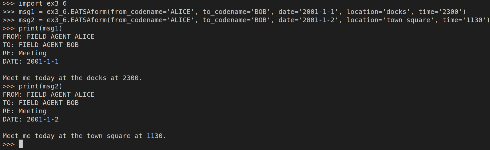

> EXERCISE 3.6: SENDING BOB A MESSAGE
> 
> Using either a modification of the preceding program or your AES encryptor 
> from the beginning of the chapter, create a couple of meetup messages 
> from Alice to Bob. Also create a few from Bob to Alice. Make sure that 
> you can correctly encrypt and decrypt the messages. 

--------------------------------

```python
# Suppose the following code is in a file named: ex3_6.py 

from cryptography.hazmat.primitives.ciphers import Cipher, algorithms, modes
from cryptography.hazmat.backends import default_backend

class Padding:
    @staticmethod    
    def pad_it_up(msg: bytes) -> bytes: 
        '''
        This function is used to pad the message.

        Technique: Determine the number of padding bytes required.
        This is a number n which satisfies 1 <= n <= 16
        and n + len(msg) is a multiple of 16. Pad the plaintext by appending
        n bytes, each with value n. (Read more in Chapter 4 of the book  
        "Cryptography Engineering by Niels Ferguson, Bruce Schneier, Tadayoshi Kohno".)
        ''' 
        n = 16 - len(msg) % 16
        return msg + bytes([n] * n)
    
    @staticmethod
    def unpad_it_up(msg: bytes) -> bytes: 
        '''this function is used to remove the pads from the message''' 
        n = msg[-1]
        # then ignore the last n bytes
        return msg[:-1*n]

# Alice and Bob's Shared Key 
test_key = bytes.fromhex('00112233445566778899AABBCCDDEEFF')

def encrypt_using_aes_ecb(plaintext: str, key: bytes) -> str: 
    proper_plaintext = Padding.pad_it_up(plaintext.encode('utf-8'))
    aesCipher = Cipher(algorithms.AES(key), modes.ECB(), backend=default_backend())
    aesEncryptor = aesCipher.encryptor()
    ciphertext = aesEncryptor.update(proper_plaintext)
    return ciphertext.hex(chr(10),-16) # this will insert '\n' between every 16-byte block. 

def decrypt_using_aes_ecb(ciphertext: str, key: bytes) -> str: 
    proper_ciphertext = bytes.fromhex(ciphertext.replace('\n',''))
    aesCipher = Cipher(algorithms.AES(key), modes.ECB(), backend=default_backend())
    aesDecryptor = aesCipher.decryptor()
    plaintext = aesDecryptor.update(proper_ciphertext)
    plaintext = Padding.unpad_it_up(plaintext)
    return plaintext.decode()

def EATSAform(from_codename: str, to_codename: str, date: str, location: str, time: str): 
    # Note that EATSA stands for East Antarctica Truth Spying Agency 😉
    return f"FROM: FIELD AGENT {from_codename}\n" \
    f"TO: FIELD AGENT {to_codename}\n" \
    f"RE: Meeting\n" \
    f"DATE: {date}\n" \
    f"\nMeet me today at the {location} at {time}."
```

First generate the messages: 



Then encrypt both of the messages: 


Look at the two ciphertext outputs of these messages side-by-side. 

No | Ciphertext 1 Blocks | Ciphertext 2 Blocks
---|--------------------|---------------------
1| e5423e662cb98ca3ecf2c66b31cf1c8b | e5423e662cb98ca3ecf2c66b31cf1c8b
2| f7c240c61a9c1453aae2edb028fa8459 | f7c240c61a9c1453aae2edb028fa8459
3| 3d6ec4443f76ebc5a8abb94879113e58 | 3d6ec4443f76ebc5a8abb94879113e58
4| 88191d257c5970af6774a9f696681766 | 88191d257c5970af6774a9f696681766
5| 9473f734c616d05dae998037a11f67ab | a9f7e4995ec96761b811c24953c19907
6| ee0c3ea2b40c09d80e9558cacf1a60ef | f70cc1a151a388f34c59b7b83ae0fb08
7| 66651c2dc32f4c25f276968d8efda22d | 4d91ea64099f6cb3dea4d1c0edcab02f
8| [empty]                          | 5a31ed03bf733b150ca46118d8fd8e95

Note that the first 4 ciphertext blocks are the same. 

Remember that AES in its raw mode is like a code book. For every input and key, 
there is exactly one output, independent of any other inputs. Thus, because much 
of the message header is shared between messages, much of the output is also the same. 

Last step, check if the ciphertexts decrypt correctly: 


Or: 


