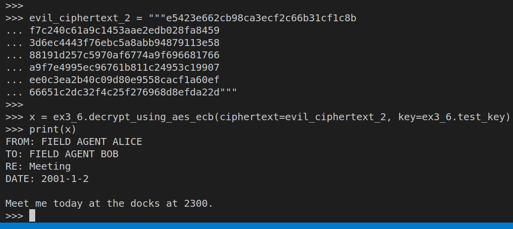

> EXERCISE 3.7 SENDING BOB A FAKE MESSAGE
> 
> Take two different ciphertexts from Alice to Bob with different meeting instructions
> on different dates. Splice the ciphertext from the body of the first message into the 
> body of the second message. That is, start by replacing the last block of the newer message
> with the last block (or blocks if it was longer) of the previous message. Does the message 
> decrypt? Did you change where Bob goes to meet Alice? 

--------------------------------

The following table is taken from the previous exercise (Exercise 3.6): 

No | Ciphertext 1 Blocks | Ciphertext 2 Blocks
---|--------------------|---------------------
1| e5423e662cb98ca3ecf2c66b31cf1c8b | e5423e662cb98ca3ecf2c66b31cf1c8b
2| f7c240c61a9c1453aae2edb028fa8459 | f7c240c61a9c1453aae2edb028fa8459
3| 3d6ec4443f76ebc5a8abb94879113e58 | 3d6ec4443f76ebc5a8abb94879113e58
4| 88191d257c5970af6774a9f696681766 | 88191d257c5970af6774a9f696681766
5| 9473f734c616d05dae998037a11f67ab | a9f7e4995ec96761b811c24953c19907
6| ee0c3ea2b40c09d80e9558cacf1a60ef | f70cc1a151a388f34c59b7b83ae0fb08
7| 66651c2dc32f4c25f276968d8efda22d | 4d91ea64099f6cb3dea4d1c0edcab02f
8| [empty]                          | 5a31ed03bf733b150ca46118d8fd8e95

I took the first $5$ blocks of the second ciphertext and the $6$ th and $7$ th block 
of the first ciphertext to create an evil ciphertext as shown below: 

The original message from Alice to Bob on the 2nd of January was to meet 
at "town square" at "1130". Thus Bob is going to try to meet Alice at the 
wrong place and wrong time on January 2, 2001. 

Moral of the story: Don't use AES-ECB in production!!!