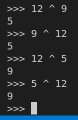

> EXERCISE 3.8: XOR EXERCISE
> 
> Because we will use XOR so much, it's a good idea to get comfortable 
> with XOR operations. In a Python interpreter, XOR a few numbers together. 
> Python supports XOR directly using ^ as the operator. So, for example, 
> 5^9 results in 12. What do you get when you try 12 ^ 9? What do you get when 
> you try 12 ^ 5? Try this out with several different numbers. 

--------------------------------

Since we know that 5^9 = 12, we can deduce that 

12 ^ 9 = (5 ^ 9) ^ 9 = 5 ^ (9 ^ 9) = 5 ^ 0 = 5 

and 

12 ^ 5 = (5 ^ 9) ^ 5 = (9 ^ 5) ^ 5 = 9 ^ (5 ^ 5) = 9 ^ 0 = 9 

Fun facts abot XOR: 

1. XOR can be considered as the addition-modulo $2$ operator in $\Z _2$ and 
hence satisfies the following properties: 
    1. Associativity: (a ^ b) ^ c = a ^ (b ^ c)
    2. Identity Element: 0
    3. Commutativity: a ^ b = b ^ a 
    4. The inverse of bit 0 is 0. The inverse of bit 1 is 1. 

2. a ^ a = 0 
3. a ^ 0 = a 

Good articles about XOR: 
1. https://accu.org/journals/overload/20/109/lewin_1915/ 
2. https://florian.github.io/xor-trick/ 
