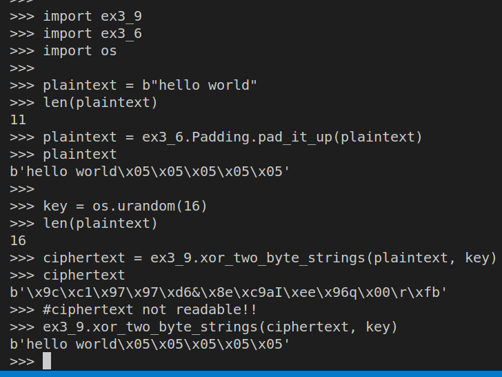

> EXERCISE 3.9: THE MASK OF XOR-0? 
> 
> Although this exercise will be even more important in counter mode, it's 
> useful to understand how XOR can be used to _mask_ data. Create $16$ bytes 
> of plaintext (a $16$-character message) and $16$ bytes of random data 
> (e.g., using `os.urandom(16)`). XOR these two messages together. 
> There's no built-in operation for XORing a series of bytes, so you'll 
> have to XOR each byte individually using, for example, a loop. When you are done, 
> take a look at the output. How "readable" is it? Now, XOR this output with the 
> same random bytes again. How does the output look like now? 

--------------------------------

```python
# ex3_9.py 

def xor_two_byte_strings(x: bytes, y: bytes) -> bytes: 
    assert(len(x) == len(y))
    
    result = []
    for _1, _2 in zip(x, y): 
        result.append(_1 ^ _2)
    return bytes(result)
```

