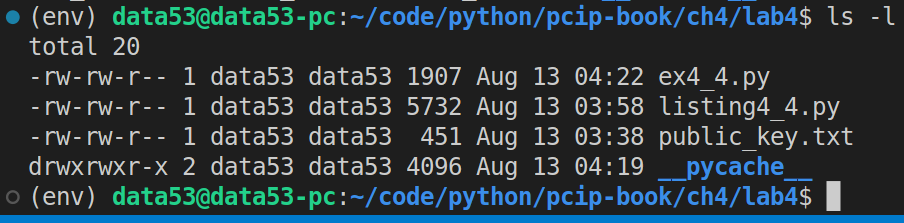
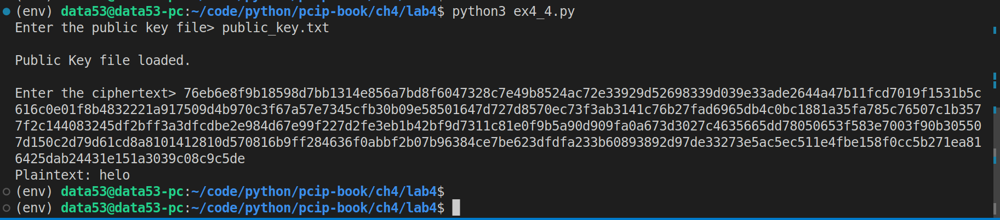
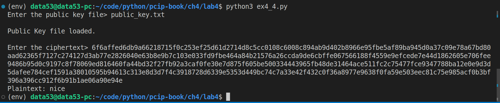

> EXERCISE 4.4: BRUTE-FORCE RSA 
> 
> Write a program that uses brute force to decrypt an RSA-encrypted word that is all
> lowercase (no spaces) and has length less than or equal to 4. The program should take a public key
> and the RSA-encrypted ciphertext as the inputs. Use the RSA encryption program to generate 
> a few words of four or fewer letters and break these codes with your brute-force program. 

--------------------------------

This exercise is very similar to **Exercise 2.7**. 

Since the password is constructed from lowercase letters, the python equivalent for this is 
`string.ascii_lowercase`. The length of this sequence is $26$.

Question: How many possible plaintexts are there? 
 
Answer: $26 + 26^2 + 26^3 + 26^4 = 475,254$

```python
# ex4_4.py
import string
import gmpy2,os, binascii
from cryptography.hazmat.backends import default_backend 
from cryptography.hazmat.primitives.asymmetric.types import PublicKeyTypes 
from cryptography.hazmat.primitives import serialization 

# This module is defined in the solution of Exercise 4.1
import listing4_4

MAX_LEN_OF_PLAINTEXT = 4

# taken from solution of Exercise 2.7
def generate(alphabet, max_len):
    if max_len <= 0: return
    for c in alphabet:
        yield c
    for c in alphabet:
        for next in generate(alphabet, max_len-1):
            yield c + next

def rsa_encrypt(pk, m: str): 
    '''
    pk: is the public key. 
    m: is the message in strings.
    '''
    m = m.encode() 
    m = listing4_4.bytes_to_int(m)

    # c is the ciphertext in integer 
    c = listing4_4.simple_rsa_encrypt(m = m, public_key=pk)

    # change c into bytes. 
    c = listing4_4.int_to_bytes(c)

    # hexlify c and return it.
    return c.hex()

def main(public_key: PublicKeyTypes, ciphertext: str): 
    for possible_plaintext in generate(alphabet=string.ascii_lowercase, max_len=MAX_LEN_OF_PLAINTEXT): 
        if rsa_encrypt(pk=public_key, m=possible_plaintext) == ciphertext: 
            # we have successfully found a pre image. 
            print(f"Plaintext: {possible_plaintext}")
            break
    else: 
        print("No preimage found.")


if __name__ == '__main__': 
    public_key_file = input("Enter the public key file> ") 
    public_key = None 

    if not os.path.exists(public_key_file):
        print("File does not exist.")
        exit(-1)
    
    with open(public_key_file, 'rb') as f: 
        public_key = serialization.load_pem_public_key(
            data=f.read(),
            backend=default_backend()
        )
        print("\nPublic Key file loaded.\n")

    ciphertext = input("Enter the ciphertext> ") 
    main(public_key=public_key, ciphertext=ciphertext) 
```

Suppose the code above is inside of a file called `ex4_4.py`.

This is what the working directory for this exercise should look
like: 


Notice that we are using the code given in the solution of Exercise 4.1 (`listing4_4.py`).

The file `public_key.txt` contains the following: 

```
-----BEGIN PUBLIC KEY-----
MIIBIjANBgkqhkiG9w0BAQEFAAOCAQ8AMIIBCgKCAQEAk+NWmBeMjnY7KXgdIm2C
XcAS9h9ekBFchu2B1MHrrMPHmxQKQr/cGQs5tc8Qg6pWpSKRgmmBA42vgOTnE+CL
uPvK187DEbDN8FfMWCQfUuvsE+u8mHwPS067IoL8sROY1SPhS6Pru2uhwLoPVNmI
CKVwqHb5j6ByuZRjlGN/ws1xDzscdOmjoIGVVy+yw9KA2P6ynarxATUqeUWiZdCZ
3bnZ/xHBlZlRodKc0F0nOVkuLKduO91tHP5Dqdch6vmHsFb79L0YI62BYIcwR7QV
F8vIlOU0MDHYnASkgO8xQ1wO21zTWRmZrNGfGYtZ6xJ7XnTW7UUYxBNYM43wFQNN
mQIDAQAB
-----END PUBLIC KEY-----
```

Now, that we know what is contained in every file, let's run `ex4_4.py`: 



