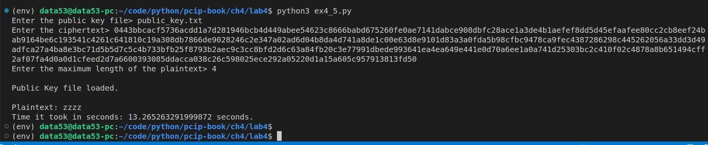
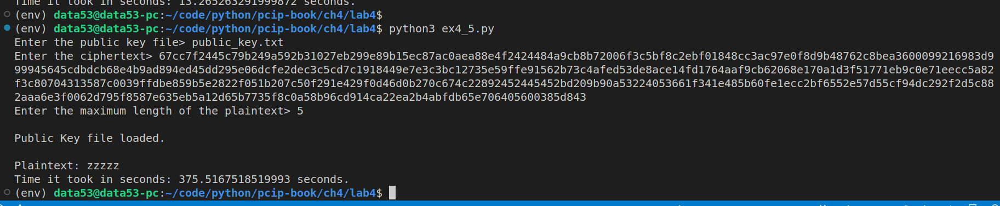

> EXERCISE 4.5: WAITING IS THE HARDEST PART
> 
> Modify the brute-force program to try all possible words of five or fewer letters. 
> Measure the time it takes (worst case) to brute force a four-letter word vs 
> a five-letter word. About how many times longer does it take and why? 
> How long would it take to try all possible six-letter words? 

--------------------------------

Question: How may words can be formed using at most $n$ characters?

|No of Characters|Number of words formed using at most $n$ characters|
|--------------------------|-------------------------|
|$4$|$26 + 26^2 + 26^3 + 26^4 = 475,254$|
|$5$|$26 + 26^2 + 26^3 + 26^4 + 26^5 = 12,356,630$|
|$6$|$26 + 26^2 + 26^3 + 26^4 + 26^5 + 26^6 = 321,272,406$|
|$n$|$\frac{26}{25}(26^n-1)$|

```python
# ex4_5.py

import string
import gmpy2,os, binascii
from cryptography.hazmat.backends import default_backend 
from cryptography.hazmat.primitives.asymmetric.types import PublicKeyTypes 
from cryptography.hazmat.primitives import serialization 

# This module is defined in the solution of Exercise 4.1
import listing4_4

import timeit 

# taken from solution of Exercise 2.7
def generate(alphabet, max_len):
    if max_len <= 0: return
    for c in alphabet:
        yield c
    for c in alphabet:
        for next in generate(alphabet, max_len-1):
            yield c + next

def rsa_encrypt(pk, m: str): 
    '''
    pk: is the public key. 
    m: is the message in strings.
    '''
    m = m.encode() 
    m = listing4_4.bytes_to_int(m)

    # c is the ciphertext in integer 
    c = listing4_4.simple_rsa_encrypt(m = m, public_key=pk)

    # change c into bytes. 
    c = listing4_4.int_to_bytes(c)

    # hexlify c and return it.
    return c.hex()

def main(public_key_file: str, ciphertext: str, length_of_plaintext: int): 
    public_key = None 

    if not os.path.exists(public_key_file):
        print("File does not exist.")
        exit(-1)
    
    with open(public_key_file, 'rb') as f: 
        public_key = serialization.load_pem_public_key(
            data=f.read(),
            backend=default_backend()
        )
        print("\nPublic Key file loaded.\n")

    for possible_plaintext in generate(alphabet=string.ascii_lowercase, max_len=length_of_plaintext): 
        if rsa_encrypt(pk=public_key, m=possible_plaintext) == ciphertext: 
            # we have successfully found a pre image. 
            print(f"Plaintext: {possible_plaintext}")
            break
    else: 
        print("No preimage found.")


if __name__ == '__main__': 
    public_key_file = input("Enter the public key file> ") 
    ciphertext = input("Enter the ciphertext> ") 
    max_length = int(input("Enter the maximum length of the plaintext> "))
    
    total_execution_time = timeit.timeit(
        stmt=f"main(public_key_file='{public_key_file}', ciphertext='{ciphertext}', length_of_plaintext={max_length})",
        setup="from __main__ import main",
        number = 1
    )
    print(f"Time it took in seconds: {total_execution_time} seconds.")
```

Worst case is achieved when the plaintext is `zzzz` (for the four-letter word case) and 
`zzzzz` (for the five-letter word case). 




Note that the public key I was using in the above sessions was the same public 
key I used in Execrsie 4.4. 

> Measure the time it takes (worst case) to brute force a four-letter word vs 
> a five-letter word. About how many times longer does it take and why? 

As shown above: 
* the time it took to bruteforce a four-letter word is about $13.27$ seconds. 
* the time it took to bruteforce a five-letter word is about $375.52$ seconds. 

Thus the time it takes to bruteforce a five-letter word is about the same as 
$28$ times the time it takes to bruteforce a four-letter word. We got a number 
closer to $26$ because there are $26$ letters in our alphabet. 

> How long would it take to try all possible six-letter words? 

My guess is $10,630 \text{seconds} \approx 2 \text{hours and } 57 \text{minutes} $. 
