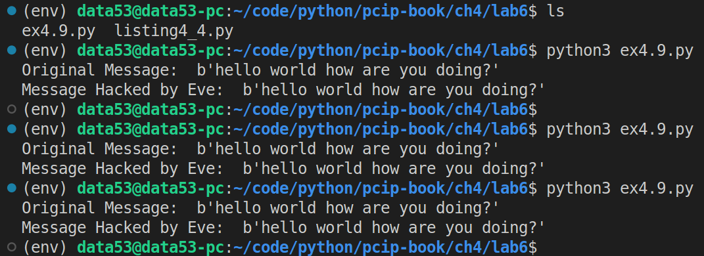

> EXERCISE 4.9: COMMON MODULUS ATTACK 
> 
> Test out the code in this section by creating a common modulus attack demo. 

--------------------------------

Suppose the following code is inside of a file called `ex4.9.py`.

Also note that, `listing4_4.py` is the code given in Listing 4.4 of the book. 

```python
from cryptography.hazmat.backends import default_backend
from cryptography.hazmat.primitives.asymmetric import rsa 
import listing4_4 as l 

def bezouts_theorem(a: int, b: int) -> (int, int): 
    '''
    Let a and b be positive integers. Then the equation 
        a*u + b*v = gcd(a,b) [Bezout's Theorem]
    always has a solution in integers u and v. 

    This function simply returns those integers (u,v) as  a tuple. 
    '''
    class BezoutNumber: 
        def __init__(self, num: int, coeff_of_a: int, coeff_of_b: int):
            self.num = num
            self.u = coeff_of_a # u is a coefficient of a.
            self.v = coeff_of_b # v is a coefficient of b. 
            assert(self.u * a + self.v * b == self.num) 
        
        def __lt__(self, x): 
            assert(isinstance(x, BezoutNumber))
            return self.num < x.num 
        
        def __mod__(self, rhs): 
            assert(isinstance(rhs, BezoutNumber))
            # print("self: ", self, "\trhs: ", rhs)
            u_i = self.u 
            v_i = self.v 
            u_ip1 = rhs.u # u_{i+1}
            v_ip1 = rhs.v
            q_ip1 = self.num // rhs.num

            return BezoutNumber(
                num=self.num % rhs.num,
                coeff_of_a=u_i - u_ip1 * q_ip1,
                coeff_of_b=v_i - v_ip1 * q_ip1,
            )

        def __str__(self): 
            return f"{self.u} * {a} + {self.v} * {b} = {self.num}"

    def bezout_gcd(a: BezoutNumber,b: BezoutNumber)->BezoutNumber:
        '''
        impelements the euclidean algorithm for finding
        gcd: greatest common divisor
        '''
        while True:
            if a < b: 
                a,b = b,a
            if b.num == 0:
                return a 
            a,b = b,a%b
    
    result = bezout_gcd(
        a = BezoutNumber(num=a, coeff_of_a=1, coeff_of_b=0), 
        b = BezoutNumber(num=b, coeff_of_a=0, coeff_of_b=1),
    )
    return (result.u, result.v)

def common_modulus_decrypt(c1, c2, key1, key2): 
    key1_numbers = key1.public_numbers() 
    key2_numbers = key2.public_numbers() 

    if key1_numbers.n != key2_numbers.n: 
        raise ValueError("Common modulus attack requires a common modulus") 
    n = key1_numbers.n 

    if key1_numbers.e == key2_numbers.e: 
        raise ValueError("Common modulus attack requires different public exponents") 
    
    e1, e2 = key1_numbers.e, key2_numbers.e 

    a, b = bezouts_theorem(e1, e2) 
    mx = pow(c1, a, n) 
    my = pow(c2, b, n) 
    # Note that, although not stated explicitly we are assuming that 
    # the gcd(e1, e2) = 1. 
    return mx * my % n  

if __name__ == '__main__': 
    private_key1 = rsa.generate_private_key(
        public_exponent=65537, 
        key_size=2048, 
        backend=default_backend(), 
    )
    public_key1 = private_key1.public_key() 

    n = public_key1.public_numbers().n 
    public_key2 = rsa.RSAPublicNumbers(3, n).public_key(default_backend())

    message = b"hello world how are you doing?"
    message = l.bytes_to_int(message) 

    c1 = l.simple_rsa_encrypt(message, public_key1)
    c2 = l.simple_rsa_encrypt(message, public_key2) 

    print("Original Message: ", l.int_to_bytes(message))
    print("Message Hacked by Eve: ", l.int_to_bytes(
        common_modulus_decrypt(
            c1=c1, 
            c2=c2, 
            key1=public_key1, 
            key2=public_key2, 
        )
    ))
```

Execution: 



