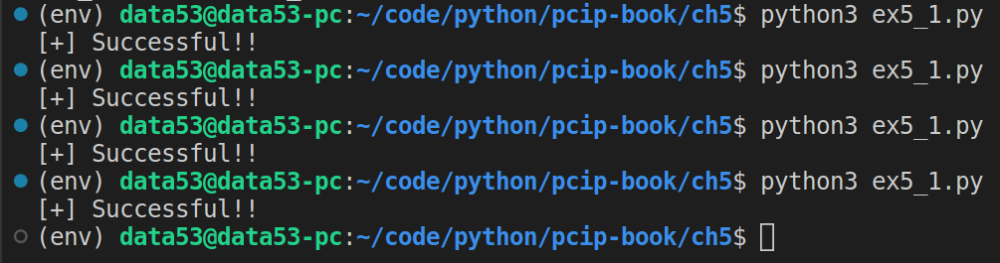

> EXERCISE 5.1: TRUST BUT VERIFY 
> 
> Finish out the code of the simple encryption plus hash system and add a decryption
> operation. The decryption operation should, upon finalization, recompute the hash 
> of the ciphertext and compare it to the hash that was sent over. If the 
> hashes don't match, it should raise an exception. Be careful! The MAC is not 
> encrypted and should not be decrypted! If you don't think carefully about this, 
> you might decrypt data that doesn't exist!

--------------------------------

```python
# ex5_1.py 

# FAKE MAC WITH SYMMETRIC ENCRYPTION 
from cryptography.hazmat.primitives.ciphers import Cipher, algorithms, modes 
from cryptography.hazmat.backends import default_backend 
import os, hashlib 

class MessageWasTamperedWithError(Exception): 
    pass 

class Encryptor: 
    def __init__(self, key, nonce): 
        aesContext = Cipher(algorithms.AES(key), modes.CTR(nonce), backend=default_backend())
        self.encryptor = aesContext.encryptor()
        self.hasher = hashlib.sha256()

    def update_encryptor(self, plaintext): 
        ciphertext = self.encryptor.update(plaintext) 
        self.hasher.update(ciphertext) 
        return ciphertext 


    def finalize_encryptor(self): 
        return self.encryptor.finalize() + self.hasher.digest() 

class Decryptor: 
    def __init__(self, key: bytes, nonce: bytes, digest: bytes): 
        aesContext = Cipher(algorithms.AES(key), modes.CTR(nonce), backend=default_backend())
        self.decryptor = aesContext.decryptor() 
        self.hasher = hashlib.sha256() 
        self.digest = digest
    
    def update_decryptor(self, ciphertext: bytes): 
        plaintext = self.decryptor.update(ciphertext) 
        self.hasher.update(ciphertext) 
        return plaintext 

    def finalize_decryptor(self): 
        if self.hasher.digest() != self.digest:
            print(self.hasher.digest(), '\n' ,self.digest)
            raise MessageWasTamperedWithError()
        return self.decryptor.finalize()
    
    @staticmethod
    def get_mac(ciphertext: bytes): 
        return ciphertext[-32:]


if __name__ == '__main__': 
    key = os.urandom(32)
    nonce = os.urandom(16) 

    encryptionManager = Encryptor(key, nonce) 
    plaintext = b"Hi Bob, this is Alice !"
    ciphertext = encryptionManager.update_encryptor(plaintext)
    ciphertext += encryptionManager.finalize_encryptor() 
    
    decryptionManager = Decryptor(key=key, nonce=nonce, digest=Decryptor.get_mac(ciphertext))
    _plaintext = decryptionManager.update_decryptor(ciphertext=ciphertext[:-32])
    _plaintext += decryptionManager.finalize_decryptor() 

    assert(plaintext == _plaintext) 
    
    print("[+] Successful!!")
```


When you run the above code multiple times, you get the following: 

