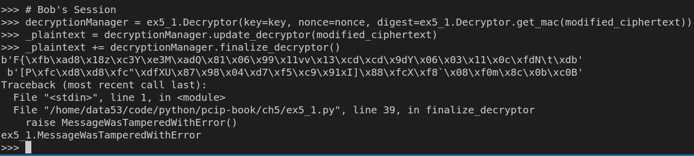

> EXERCISE 5.2: EVER EVIL EVE 
> 
> Go ahead and "intercept" some of the messages encrypted by the 
> code you wrote in this section. Modify the intercepted messages 
> and verify that your decryption mechanism correctly reports an error. 

--------------------------------

Alice first creates her `plaintext`. Then she uses her newly generated 
`key` and `nonce` to encrypt her `plaintext`.

Then she sends her `ciphertext`, `key`, and `nonce` to Bob. 

Suppose Eve intercepts Alice's `ciphertext` but not Alice's
`key` and `nonce`. 

Suppose Eve modifies only the first byte of the ciphertext: 

Eve then sends the modified ciphertext to Bob.

Bob then tries to decrypt the `modified_ciphertext`.

Thus our decryption mechanism correctly reports an error as shown above. 