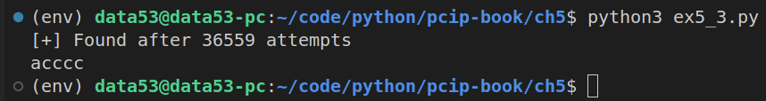

> EXERCISE 5.3: BRUTE FORCE AGAIN
> 
> You should already have done some brute-force 
> attacks in previous chapters, but it's important
> to repeat the exercise until you develop intuition 
> for the concept. Using our preceding fake HMAC,
> have the computer generate a random password 
> of specific sizes and use brute-force methods 
> to find out what it is. To be more specific, 
> assume that you already know what the 
> message is (e.g. "hello world", "happy birthday", 
> or a message of your choosing). Write a program 
> to create a random password of characters, 
> prepend the password to the message, and then 
> print out the MAC (hash). Take the output 
> and iterate through all possible passwords
> until you find the right one. Start with a simple
> test of a single-letter character, then try two 
> characters, and so forth. Mix things up by using 
> different sets of characters such as all 
> lowercase, lowercase and uppercase, either 
> case plus numbers, and so forth. 

--------------------------------

```python
# ex5_3.py 

import hashlib 
from string import ascii_lowercase

class PasswordNotFoundException(Exception):
    pass 

def generate(len_of_password: int, alphabet: str = ascii_lowercase):
    if len_of_password <= 0: return

    elif len_of_password == 1: 
        for c in alphabet:
            yield c

    else:
        for c in alphabet:
            for next in generate(len_of_password-1, alphabet):
                yield c + next

def h(x: bytes) -> str:
    '''returns the sha256 digest of the string x.'''
    return hashlib.sha256(x).hexdigest()


def bruteforce(digest: str, plaintext: bytes, len_of_password: int = 5) -> str:
    '''
    Searches and returns the password p, satisfying: 
        sha256(p + plaintext) = digest.
    
    The space this bruteforce search is in, all possible
    lowercase words that are of length len_of_password.

    Raises the exception PasswordNotFoundException, if password
    was not found.
    '''

    counter = 0
    for p in generate(len_of_password=len_of_password):
        counter += 1 
        if h(p.encode() + plaintext) == digest:
            print(f"[+] Found after {counter} attempts")
            return p 
    else:
        raise PasswordNotFoundException()
    
if __name__ == '__main__':
    print(
        bruteforce(
            digest='bddd033f5cbc2e88194a941abc314d7f5259764453f99b367d762ad49d3ed47f',
            plaintext=b"hello world",
            len_of_password=5,
        )
    )
```

