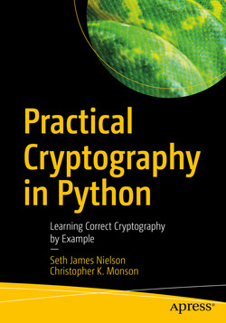

# practical_cryptography_in_python_answers
Solutions to the book "Practical Cryptography in Python"



Here is a link to the book: https://www.oreilly.com/library/view/practical-cryptography-in/9781484249000/

I used Python 3.10.12 for the scripts in this repo. 

Extra modules that need to be installed are: 

```
cffi==1.15.1
colorama==0.4.6
cryptography==40.0.2
gmpy2==2.1.5
pycparser==2.21
```